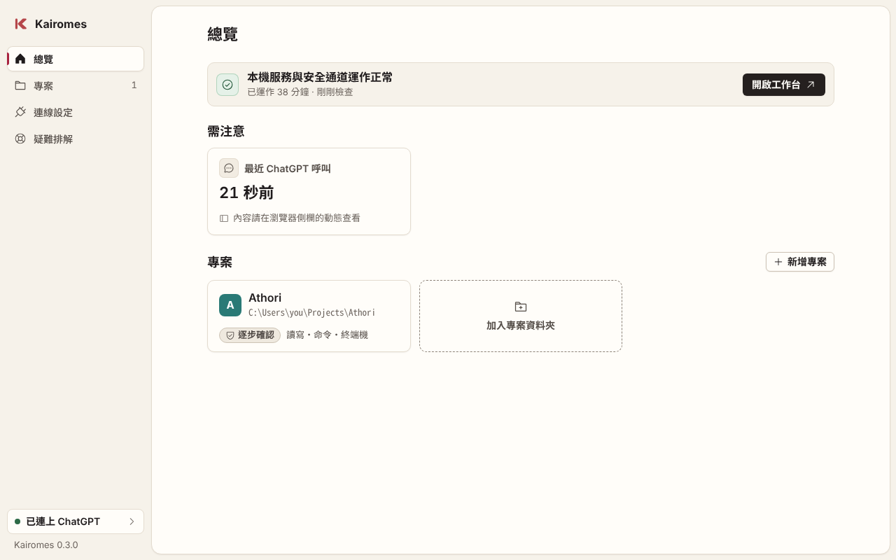
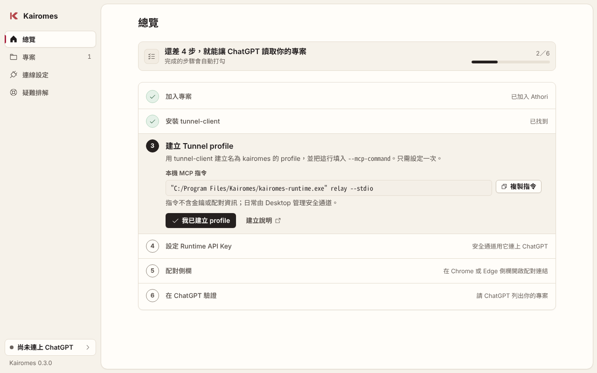

<h1>Kairomes</h1>

<b>ChatGPT が、あなたのパソコン上のプロジェクトフォルダを使えるように。 ファイルの変更もコマンドの実行も、あなたが承認するまで動きません。</b>

  
  
  
  
  
  
  
  

<a href="README.md">繁體中文</a> · <a href="README.en.md">English</a> · <b>日本語</b>

<picture>
  <source media="(prefers-color-scheme: dark)" srcset="docs/images/desktop-ready-dark.png">
  
</picture>

Kairomes は Windows のバックグラウンドで動き、OpenAI Secure MCP Tunnel 経由で ChatGPT からのリクエストを受け取ります。ファイルの変更、コマンドの実行、画像の保存をする前に、Chrome／Edge のサイドパネルで確認を求めます。あなたが承認するまで何も実行されません。

ChatGPT の Cookie やチャット画面は読み取らず、あなたの代わりにメッセージを送ることもありません。名前は Kairo（回路）と Hermes（使者）に由来します。

> 現在のバージョン：[v0.3.0](https://github.com/tennosuke5245/Kairomes/releases/tag/v0.3.0)（プレビュー版）。変更点は[更新履歴](CHANGELOG.md)にあります。インストーラーはまだ署名されていないため、Windows で SmartScreen の警告が出ることがあります。サイドパネルは手動で読み込む必要があります。
>
> アプリの画面と詳しいドキュメントは、今のところ繁体字中国語のみです。以下ではボタン名を中国語のまま書き、日本語の意味を添えています。

## できること

- 指定したプロジェクトを ChatGPT が読んだり検索したりできます。フォルダを丸ごとアップロードすることはなく、ChatGPT が求めた内容だけを返します。
- Git のブランチ、変更、差分、最近のコミットを確認できます（読み取り専用）。
- ChatGPT が作った画像をプロジェクトに保存できます。画像はサイドパネルでプレビューし、確認してから書き込みます。
- ファイルの変更やコマンドをサイドパネルで承認・却下できます。却下するときに理由を書くと、ChatGPT がそれに合わせて調整します。
- 時間を区切った自律モードがあり、その間は ChatGPT が毎回確認を求めずに作業できます。
- サイドパネルから他の MCP サーバーを追加できます。ローカルのプログラムでもリモートの URL でも使えます。
- Codex での作業を要約にまとめ、ChatGPT に貼り付けて続きを進められます。

ライトモードとダークモードの両方に対応しています。

## インストール

事前に用意するもの：

- Windows 11 と Chrome または Edge。
- [Releases](https://github.com/tennosuke5245/Kairomes/releases/tag/v0.3.0) にある Kairomes のインストーラーとサイドパネルの ZIP。
- OpenAI 公式の [`tunnel-client`](https://github.com/openai/tunnel-client/releases/latest)。Windows 版を一式インストールし、`tunnel-client.exe` を PATH に追加してください。
- ChatGPT の developer mode を有効にしておくこと。OpenAI Platform で Tunnel を作るには Tunnels Read + Manage、使うには Tunnels Read + Use の権限が必要です。詳しくは[公式ガイド](https://developers.openai.com/api/docs/guides/secure-mcp-tunnels)を見てください。

### 1. Desktop とサイドパネルをインストールする

Kairomes Desktop をインストールして開きます。「總覽」（概要）ページに 6 つの設定手順が並んでいるので、順番に進めてください。最初の手順はプロジェクトフォルダの追加です。

<picture>
  <source media="(prefers-color-scheme: dark)" srcset="docs/images/desktop-setup-dark.png">
  
</picture>

サイドパネルは、ZIP を展開し、Chrome／Edge の拡張機能ページで「デベロッパーモード」をオンにして「パッケージ化されていない拡張機能を読み込む」を選び、`manifest.json` があるフォルダを指定します。このフォルダは後で消さないでください。

### 2. Tunnel profile を作る（最初の 1 回だけ）

[OpenAI Platform](https://platform.openai.com/settings/organization/tunnels) で Tunnel を作り、使いたい ChatGPT workspace につなぎます。Tunnel ID を控え、Runtime API Key を取得してください。

Desktop の「總覽」（概要）にある Tunnel profile の手順で「複製指令」（コマンドをコピー）を押します。次に PowerShell で下のコマンドを実行し、入力を求められたらコピーしたコマンドを貼り付けます。`tunnel_YOUR_ID` は自分の Tunnel ID に置き換えてください。

~~~powershell
$relay = Read-Host "Kairomes のローカル MCP コマンドを貼り付けてください"
if ($PSVersionTable.PSVersion -lt [version]'7.3' -or $PSNativeCommandArgumentPassing -eq 'Legacy') {
  $relay = $relay.Replace('"', '\"')
}
tunnel-client init `
  --sample sample_mcp_stdio_local `
  --profile kairomes `
  --tunnel-id tunnel_YOUR_ID `
  --mcp-command $relay
~~~

コピーしたコマンドはそのまま貼り付けてください。自分でバックスラッシュに書き換えると解析に失敗します。すでに `kairomes` という profile がある場合は、先に `tunnel-client profiles edit kairomes` で中身を確認してください。

### 3. 接続してサイドパネルとペアリングする

Desktop で「設定金鑰」（キーを設定）を押し、Runtime API Key を保存します。キーは Windows の資格情報マネージャーに保存されます。以後は Desktop を開くだけで自動的に接続されるので、tunnel-client を手で実行する必要はありません。

拡張機能のアイコンをクリック（または `Alt+Shift+K`）してサイドパネルを開きます。表示された Extension ID を Desktop の「連線設定 › 瀏覽器側欄」（接続設定 › ブラウザのサイドパネル）に貼り付けて「儲存並配對」（保存してペアリング）を押し、続けて「複製連結」（リンクをコピー）を押してサイドパネルに貼り付けます。ブラウザがこのパソコンの `127.0.0.1` への接続を求めてきたら許可してください。

ペアリング用のリンクは 2 分で無効になります。他人に共有したり、ChatGPT に貼り付けたりしないでください。

### 4. ChatGPT で確認する

ChatGPT で developer-mode app を作り、接続方法に Tunnel と先ほど作った接続を選びます。ChatGPT に「プロジェクトの一覧を見せて」と頼み、追加したフォルダが表示されれば完了です。ツールが表示されない場合は、Connector の設定で「更新」を押してください。

## 使い方

インストール後の日常的な操作は[操作ガイド](docs/usage.md)（繁体字中国語）にまとめています。

- Desktop の概要、プロジェクト管理、トラブルシューティング
- サイドパネルでの承認と自律モード
- ワークベンチで ChatGPT の作業内容を確認する方法
- [ChatGPT の画像を保存する](docs/usage.md#保存-chatgpt-圖片)
- [MCP サーバーの追加とログイン](docs/usage.md#加入-mcp-與登入)
- Codex からの作業の引き継ぎ

## セキュリティ

ChatGPT が自分でフォルダを追加したり、操作を承認したりすることはできません。それができるのは、あなた自身のパソコン上のあなただけです。

注意点として、コマンドとターミナルはあなたの Windows アカウントの権限で動きます。サンドボックスではありません。あなたが承認したコマンドや、自律モードで実行されたコマンドは、プロジェクト外のファイルにアクセスしたり、ネットワークに接続したりする可能性があります。

Runtime API Key、ペアリング用のリンク、ローカルのワークベンチ URL、診断ログは共有しないでください。詳しくは [SECURITY.md](SECURITY.md) を見てください。

Kairomes は独立したオープンソースプロジェクトです。OpenAI の公認を受けておらず、ChatGPT の公開ストアにも掲載されていません。

## 開発

ビルド方法とチェック用のコマンドは[コントリビューションガイド](CONTRIBUTING.md)を、参加する前に[行動規範](CODE_OF_CONDUCT.md)を読んでください。コードは [MIT ライセンス](LICENSE)で公開しています。
