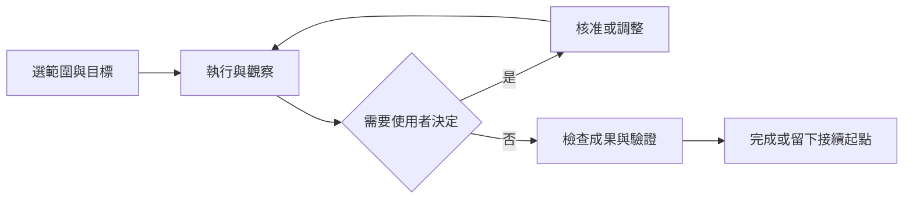

# Agent App 設計模式與採用決策

研究日期：2026-10-02。依據：[Codex](codex-app-research.md)、[Claude Code](claude-code-research.md)、[Kairomes 現況](kairomes-current-state.md)。這是產品設計推論；現有能力、官方文件與待開發項目分開記錄。

## 共通工作循環

兩者都把工作範圍、執行狀態、權限與成果放在對話附近，讓使用者可以在 Agent 自主工作時介入。具體配置依 surface、版本與執行環境不同；不應將某張官方宣傳畫面當作所有帳號的布局規格。

Kairomes 的價值在「本機控制與成果檢查」。ChatGPT 已提供對話與模型選擇；側欄只補其缺少的本機操作資訊。

| 模式 | Codex／Claude 的證據 | Kairomes 決策 | 優先級 |
| --- | --- | --- | --- |
| 專案與工作範圍明示 | O1 導覽；Claude session／repo 選擇 | 用完整專案短名與選擇器取代只能看 initials 的判斷；保留正確來源範圍 | P0 |
| 需要人處理時突出 | 文件中的 permissions、review、activity | 單件決策＋待處理件數；以真實 pending 請求為準 | P0 |
| 執行與完成分離 | diff、terminal、review／CI 等不同證據 | 工具完成與檢查通過分開，exit code／版本可核對 | P0／P1 |
| 漸進揭露 | O1 Add 集中；A2 review／terminal 分區 | 單閱讀區、詳細 diff／輸出按需進入；保留返回與捲動位置 | P0 |
| 平行工作與隔離 | Worktree／cloud 文件 | 暫不增加桌面 IDE 或環境管理；先解決多來源活動的可信歸屬 | P1 研究／P2 |
| 計畫與執行階段 | Plan／Goal 文件 | 可加入使用者編輯的工作目標；不臆測 ChatGPT 模型階段，不把計畫核准當 shell 核准 | P2 |
| Context 視覺化 | Claude 影片有 context ring | 僅顯示真實資料範圍／截斷，沒有 ChatGPT context 百分比就不做 ring | 延後 |
| 恢復／checkpoint | Claude 官方 checkpoint 邊界 | 可評估具 hash 檢查的結構化檔案反向變更；不得宣稱復原外部副作用 | P2 |
| 跨環境接續 | O2 同產品 Hand off；Claude Continue in／teleport | 跨產品採審閱後的上下文包，先核對程式碼再執行 | P1 試點 |
| Plugins／下游 MCP | Codex Add 與 Claude 連接工具 | 沿用 Kairomes broker；優先搜尋與啟用範圍，避免將所有工具一股腦展示 | P1 |

## 介面資訊契約

同一事實只在同一決策位置說一次：頂列管理有效權限，動態卡管理一次操作的狀態，核准詳情管理授權判斷，成果詳情管理證據。不同層級不能用相同「已連線／已完成」掩蓋差異。

| 資訊 | 可以說什麼 | 不可推定 |
| --- | --- | --- |
| Panel stream | 核准通道可用／失效 | ChatGPT Tunnel 已通或模型仍在工作 |
| 工具事件 | 請求等待、執行、完成、失敗 | 使用者的整個開發任務完成 |
| 命令結果 | exit code、輸出完整性、執行時間 | 最新檔案仍通過、沒有遠端副作用 |
| 使用者的工作標籤 | 這組本機操作的目標 | 真正 ChatGPT conversation ID |
| 接續包 | 選定的歷史、目前檔案身份與下一步 | 原模型記憶、原授權或程序搬移 |

UI 的必要驗收條件是「短狀態＋必要欄位＋下一動作」。工程文件可完整；UI 不放研究理由、宣傳標語或重複說明。安全決策的必要欄位不能靠省字隱藏。

## 已形成的可重用 skills

- [agent-app-design](../../.agents/skills/agent-app-design/SKILL.md)：研究、證據分類及 Agent 工作模式判斷。
- [kairomes-sidebar-planning](../../.agents/skills/kairomes-sidebar-planning/SKILL.md)：現況核對、窄側欄規劃、權限與交接契約。

本次以這兩份 skill 的規則執行 [側欄檢視](sidebar-audit.md)、[開發計畫](development-plan.md) 與 [交接規格](handoff-spec.md)。skill 保存方法與邊界，完整研究保存於 docs；下次遇到產品更新時，重新讀程式碼與官方資料。
