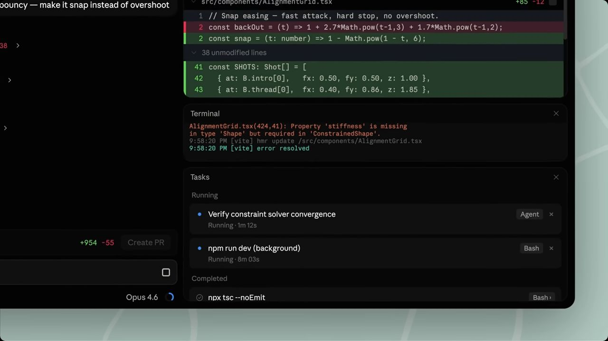
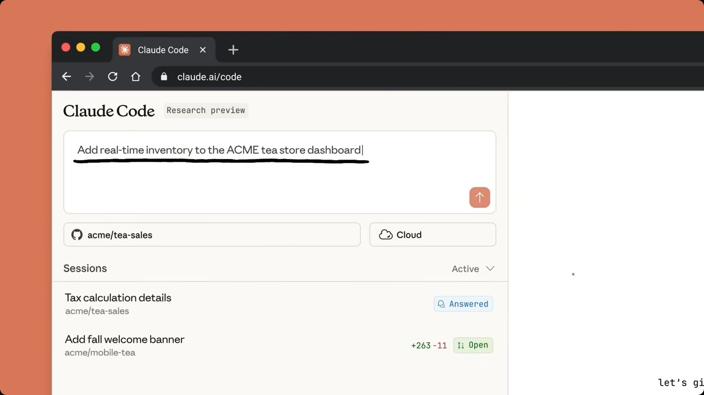

# Claude Agent 介面研究：Claude Code 與 Cowork

查閱日期：**2026-10-02（Asia/Taipei）**。研究對象是使用 Agent 開發或處理檔案工作的個人／小型團隊；目的為提煉可用於 Kairomes Chrome／Edge 輔助側欄的模式。本稿採官方公開文件、官方產品公告及公開示範影片，不使用私人登入、聊天內容或本機 Claude 安裝。

## 證據標記與限制

- **D／文件事實**：查閱日的官方文件描述，尚未在登入帳號完成實測。
- **V／畫面觀察**：實際透過 Codex in-app browser 觀看官方示範畫面；可證明可見配置，不能證明所有互動與錯誤狀態。
- **I／設計推論**：依 D／V 推導 Kairomes 的機會；不是 Claude 已實作或 Kairomes 現有功能的宣稱。
- 公開影片有拍攝時間，不能充當最新版本逐像素規格。CLI／TUI 與 Cowork 本次以官方文件為主，未進行登入操作；不推定它們和 Code 桌面有相同元件。

## 先辨識四種產品表面

| 表面 | 主要工作與環境 | 與其他表面的關係 | 依據 |
| --- | --- | --- | --- |
| Claude Code CLI／TUI | 終端機內開發，session 與專案目錄相連；鍵盤指令、狀態列、工作階段選擇器 | 有本機持續／恢復／對話分支；對話分支不等同 Git branch | [D：Manage sessions](https://code.claude.com/docs/en/sessions)、[D：Interactive mode](https://code.claude.com/docs/en/interactive-mode) |
| Claude Desktop 的 **Code** | 圖形化開發工作台；新 session 選環境、資料夾、模型、權限 | Code 內 session 清單與 CLI／VS Code 各有範圍；共享設定不代表共享全部歷史 | [D：Desktop quickstart](https://code.claude.com/docs/en/desktop-quickstart)、[D：Manage sessions](https://code.claude.com/docs/en/sessions) |
| Claude Code on the web／**cloud sessions** | 從瀏覽器／手機等入口委派雲端開發；雲端工作可在裝置關閉後繼續 | 雲端 session 與本機 Remote Control 是不同執行方式 | [D：Use Claude Code in the cloud](https://code.claude.com/docs/en/claude-code-on-the-web)、[D：Remote Control](https://code.claude.com/docs/en/remote-control) |
| Claude Cowork／整合中的 Claude | 面向檔案、文件、連接工具與長任務；Chrome 側欄亦為入口 | 使用自己的權限模型；不能拿 Code 的 `acceptEdits` 等值套用 | [D：Cowork quickstart](https://support.claude.com/en/articles/13345190-get-started-with-claude-cowork)、[D：Cowork across surfaces](https://support.claude.com/en/articles/15520349-use-claude-cowork-on-web-desktop-and-mobile) |

**版本差異（D）**：Code quickstart 仍描述 Chat／Cowork／Code 三個頁籤；同日 Cowork Help Center 已指出 Chat 與 Cowork 正逐步整合為單一 Claude，部分 Pro／Max 帳號不再顯示 Chat／Cowork 選擇器。因此「固定三頁籤」只能標成特定版本／方案的配置。官方亦預告 **2026-10-06** Pro／Max 新 Cowork 任務改在雲端執行；此日期晚於查閱日，不能寫成已完成。來源：[Desktop quickstart](https://code.claude.com/docs/en/desktop-quickstart)、[Cowork across surfaces](https://support.claude.com/en/articles/15520349-use-claude-cowork-on-web-desktop-and-mobile)。

## 官方畫面證據

### V1：桌面 Code 多面板與編輯回饋

公開來源：[2026-04-14 桌面改版公告](https://claude.com/blog/claude-code-desktop-redesign)，內嵌 [Claude 官方示範影片](https://www.youtube.com/watch?v=rWaQSQEm_aY)。本次已實際播放，觀察到約 10–17 秒的片段：

本地證據：`evidence/claude-official-02.jpg`，1280 × 720，查閱日透過 browser screenshot 儲存並重新開啟檢視。上圖是影片中段 Tasks 展開的畫面，未保存精確 timecode；影片的縮放與裁切造成主側欄及部分 composer 不完整，不據此量測實際面板尺寸。

| 可見配置 | 畫面可直接支持的觀察 | 不能由此證明 |
| --- | --- | --- |
| 對話下方的 Git 資訊帶 | 目前 branch／目標 branch、增刪行數與 Create PR 位於 prompt 上方 | PR 建立成功、檢查通過或 merge 權限 |
| prompt 下緣 | 左側權限模式，右側模型與圓形使用量提示；當時標籤為 Auto accept edits／Opus 4.6 | 查閱日的模型、方案或預設權限 |
| 右側審查面板 | 逐行 diff 以紅／綠與行號表示；Terminal 在另一面板，程式碼與命令輸出能並排 | diff 回復、衝突處理、terminal 過期等流程 |
| Tasks 面板 | Running／Completed 分組；每列有短標題、Agent／Bash 類型、運行時間及停止控制 | 每一列停止是否回收全部子程序；背景工作是否與其他 session 共用 |
| 示範的深色工作台 | 邊框與面板標題區隔資訊，主要色彩用於 diff 與活動提示 | 色彩對比、鍵盤焦點、讀屏相容性已通過驗證 |

**限制**：這是四月官方影片，不是十月登入帳號的實測。影片中的 Auto accept edits 是舊標籤；目前官方權限文件使用 Accept edits。另公開公告可取得 Code Review／CI Monitoring 圖像來源，但直接開啟其 CDN 圖片遭瀏覽器 site-safety policy 阻擋；未下載或繞過，此兩張圖不列為已檢視證據。圖像來源僅供日後可存取時複核：[Code Review.png](https://cdn.prod.website-files.com/68a44d4040f98a4adf2207b6/6998ab6c581b7e1365118a98_Code%20Review.png)、[CI Monitoring.png](https://cdn.prod.website-files.com/68a44d4040f98a4adf2207b6/6998ab7b361d36cb996e0cc8_CI%20Monitoring.png)。

### V2：web 的任務委派入口

公開來源：[Claude Code on the web 公告](https://claude.com/blog/claude-code-on-the-web)，內嵌 [Anthropic 官方示範影片](https://www.youtube.com/watch?v=s-avRazvmLg)。本次已播放；此影片來自 **2025-10-20** 發表時，公告已另附 **2026-09-23** cloud sessions 現況更新。保留影片與文件各自日期，不以舊片證明十月完整介面。

本地證據：`evidence/claude-official-01.jpg`，1280 × 720，官方影片約 15 秒處；查閱日透過 browser screenshot 儲存並重新開啟檢視。可見 prompt 下的 repo／Cloud 選擇、Sessions 的 Active 範圍，以及列上的標題、專案、Answered／Open 和 diff 數字。影片約 35 秒處另可見使用者追加測試要求與 Agent 繼續處理，沒有直接實測訊息排隊規則。

**I**：這種配置把「要做什麼」、「對哪份程式碼做」、「在哪裡執行」與「哪些工作待處理」分開，而且每列只保留少數識別與狀態欄位。Kairomes 可借用清單資訊層次；不應仿造 ChatGPT prompt、Cloud 選擇器或已登入的 session history。未連接 GitHub、提交任務或建立 PR。

### D3：Cowork 的側欄定位

官方 [2026-08-12 Chrome 公告](https://claude.com/blog/cowork-chrome-side-panel) 將側欄定位為同一 Cowork session 的入口，能使用當前頁面與登入狀態操作瀏覽器；這與 Kairomes 的本機工具監看／核准側欄不同。Kairomes 應借用少量狀態、同任務結果與跨表面接續的連貫性；不據此新增 ChatGPT 頁面讀取、cookie、debugger 或代送訊息權限。此項為文件事實及推論，本次未登入／實測 Claude Chrome extension。

## 工作流程與可抽取的模式

### Session／project／task 的資訊架構

**D**：CLI 的 session 是保存的對話，能命名、恢復與複製對話分支。`/resume` 選擇器有專案／worktree／Git branch 範圍；不同表面各有 session list，不代表同一份全域清單。來源：[Manage sessions](https://code.claude.com/docs/en/sessions)。桌面 Code 的側欄能依狀態、專案、環境篩選；當前 session 的 tasks 面板呈現內部背景工作。來源：[Desktop reference](https://code.claude.com/docs/en/desktop#manage-sessions)。

**I**：Kairomes 應明確區分「掛載專案」、「本機操作工作階段」、「一次工具／命令」與「ChatGPT 對話」。如果沒有可信 chat identity，UI 應直接顯示未綁定，避免讓使用者誤以為側欄能辨識目前 ChatGPT 聊天。狀態視圖優先呈現需要處理、執行中、完成與失敗；詳細工具輸出才展開。

### 權限與 plan → execute

**D**：Code 區分 Manual、Accept edits、Plan、Auto、Bypass permissions；CLI 另有 `dontAsk`。Auto 有獨立分類器，不等於不檢查；權限模式和 sandbox／隔離邊界是兩件事。Plan 允許探索與提出計畫，核准計畫後才切入執行模式。Cloud 支援的模式較少；相同標籤也必須連同執行表面理解。來源：[Choose a permission mode](https://code.claude.com/docs/en/permission-modes)。

**I**：Kairomes 保留自身「逐次核准／檔案自主／全自主」詞彙與真實語意，不複製 Auto 標籤暗示具有 Claude 分類器。授權卡以緊湊欄位呈現對象、能力與期限，提供收回入口；核准原因只寫一次，詳細邊界再展開。計畫核准是意圖確認，不能隱含完整主機授權；若新增 plan 卡，轉入操作仍走既有可信本機核准路徑。

### Diff、審查與完成證據

**D**：桌面官方文件描述檔案 diff、行內留言、Review code 與 PR 檢查狀態；視覺示範可見 branch／diff stats／Create PR 聚合。來源：[Desktop reference](https://code.claude.com/docs/en/desktop#review-changes-with-diff-view)、[官方 preview/review 公告](https://claude.com/blog/preview-review-and-merge-with-claude-code)。

**I**：Kairomes 的完成卡應把「Agent 說完成」、「檔案確實改變」、「檢查執行結果」分成可核對欄位。窄側欄先給檔案數／增刪摘要與失敗檢查，完整 diff 用展開或獨立檢視。進行中狀態不能直接變成已驗證完成；檢查結果要帶執行時間與對應 revision。

### Checkpoint 與回復

**D**：Code 的 rewind 可分別恢復程式碼與對話，也可摘要部分歷史；不是所有副作用都能回復。Bash 改動、部分 subagent 改動、外部改動及連結路徑有追蹤限制，checkpoint 不取代 Git。來源：[Checkpointing](https://code.claude.com/docs/en/checkpointing)。

**I**：Kairomes 若新增回復，第一版只針對其結構化檔案變更，必須驗證現在的檔案 hash 仍符合可回復條件。不能用「復原任務」承諾撤回 shell、網路或下游 MCP 副作用。讓回復支援範圍與不可回復項目在同一卡片可見。

### 平行任務與 worktree

**D**：Code Desktop 支援多 session 與 Git worktree；worktree 隔離程式碼工作樹。Cloud session 使用雲端環境；Remote Control 亦能以同目錄或 worktree 建立 session，同目錄可能衝突。來源：[Desktop reference](https://code.claude.com/docs/en/desktop#work-in-parallel-with-sessions)、[Remote Control](https://code.claude.com/docs/en/remote-control)。

**I**：先把「正在操作同一專案」的寫入風險變成可見狀態，再評估全面 worktree 管理。Kairomes 可先有 writer lease／接手鎖、唯讀共用、衝突提示與可靠釋放；worktree 是後續的開發隔離功能，不是主機 sandbox。非 Git 資料夾仍需可用。

### Terminal、context 與資訊密度

**D**：CLI 以快捷鍵控制中斷、詳細 transcript、背景工作及檔案 `@` context；context 還包含指令、記憶、工具及 skill 描述，compaction 會摘要歷史。來源：[Interactive mode](https://code.claude.com/docs/en/interactive-mode)、[Explore the context window](https://code.claude.com/docs/en/context-window)。桌面提供正常／思考／詳細顯示；integrated terminal 與 pane layout 有版本／環境條件。來源：[Desktop reference](https://code.claude.com/docs/en/desktop#arrange-your-workspace)。

**I**：側欄預設摘要，按需展開事件與已截斷輸出；保留可操作的停止入口。Kairomes 無法量測 ChatGPT 真實 context window，不應捏造百分比或顯示完整模型推理。可真實顯示工具輸入摘要、資料範圍、結果大小／截斷與過期時間。

**I／UI 文案約束**：一般狀態只顯示「短狀態＋必要欄位＋下一動作」；不要在每張卡重複解釋 Agent、MCP、權限或工作流程。例：`等待核准 · 執行檢查`，下方為專案、命令與期限，動作為 `允許`／`拒絕`；危險邊界只在核准時寫必要的一句，其餘放 `詳細內容`。功能有無價值以使用者能否判斷和行動衡量，不以文字量衡量。

## 跨環境續接：不要把所有移動叫作 handoff

| 官方機制（D） | 實際轉移或同步 | Kairomes 的推論（I） |
| --- | --- | --- |
| CLI → Desktop：`/desktop` | 將 CLI 的工作帶入桌面；官方公告描述保留上下文 | 同產品可有專用續接契約，跨供應商不能假設相容 |
| Desktop → Cloud：Continue in | 推送 branch、生成對話摘要並建立雲端 session；要求乾淨工作樹，SSH 不適用 | 在交接前確認程式碼身份及未提交變更，不能只複製對話 |
| Cloud → CLI：teleport | 取回 branch／歷史；本機得到副本，後續工作不會回寫原 cloud session | 顯示「複製後接續」及來源，避免宣稱兩端始終同步 |
| Remote Control | 程序與檔案仍在本機；其他裝置操控同一 session，本機需在線 | 若 Kairomes 仍為本機工具，離線狀態要明確，不能承諾雲端繼續 |
| Cowork 跨表面 | 帳號中的同一 cloud session 可換裝置查看；本機能力仍依 Desktop 在線 | 共享 session 和跨產品 handoff 是不同問題 |

來源：[2026-02-20 官方公告](https://claude.com/blog/preview-review-and-merge-with-claude-code)、[Desktop reference](https://code.claude.com/docs/en/desktop#continue-in-another-surface)、[Cloud sessions](https://code.claude.com/docs/en/claude-code-on-the-web#move-tasks-between-terminal-and-cloud)、[Remote Control](https://code.claude.com/docs/en/remote-control)、[Cowork across surfaces](https://support.claude.com/en/articles/15520349-use-claude-cowork-on-web-desktop-and-mobile)。上述流程均為文件事實，未直接實測。

### Codex → ChatGPT + Kairomes 的 handoff 建議

**I／建議值得納入，先強化既有能力**：[Kairomes SECURITY.md](../../SECURITY.md) 已說明本機 CLI handoff 會讀取官方 App Server 明確專案的紀錄、排除推理／附件／原始工具結果，預覽不自動發佈 MCP；未轉移權限，亦尚無 writer lease。因此這不是從零增加「搬運聊天」功能，而是把現有交接變成可審查、可接手的產品流程。

適合的最小契約是「**工作摘要＋程式碼狀態＋來源已停止的人工確認＋新的執行核准**」。交接包須有目標、限制、已完成、未完成、重要決策、已知風險、目前 revision／branch、未提交變更描述、檢查結果與下一步。來源與生成時間要可見；匯入後以目前檔案重新驗證。過往成功檢查不能證明現在仍通過。

側欄可先提供交接預覽、刪減敏感內容、發佈／撤回範圍、接手狀態與失效提示；ChatGPT 讀取已明確發佈的包，再由人確認新的操作授權。禁止把來源權限、私人 pairing URL／token 或完整逐字稿當作移轉資料。使用者自行把摘要送進 ChatGPT；extension 不需要聊天 DOM、cookies 或代送訊息權限。

## Kairomes 適用性決策

| 模式 | 決策 | 優先理由／限制 |
| --- | --- | --- |
| 工作狀態與待處理項目 | **適用，優先** | 輔助側欄的核心是察覺阻塞、核對結果並核准 |
| 明確權限範圍、到期與收回 | **適用，優先** | 現有主機執行邊界必須讓人理解 |
| 可審查 diff／完成證據 | **適用，優先** | 提升對檔案改動與檢查結果的信任 |
| 多層資訊摘要／詳細 | **適用** | 狹窄面板不適合預設展開全部工具輸出 |
| Handoff 接手契約／writer lease | **適用，分階段** | 既有 CLI 匯入可延伸；需要身份、版本與並行寫入約束 |
| 完整可拖曳多面板 IDE | **不適合直接搬入側欄** | 寬螢幕工作台模式應改成按需展開或外部檢視 |
| Claude Auto 分類器／Bypass 對照 | **不能照名移植** | Kairomes 沒有同一分類器或 sandbox；描述自身真實授權即可 |
| ChatGPT context ring／模型切換 | **目前不適用** | 側欄沒有可信資料與控制契約 |
| 自動 merge／全面 browser control | **延後，不由本研究直接要求** | 不屬於檢視本機操作與交接的最小價值；新增會擴大權限與範圍 |

## 後續驗證與更新條件

1. 下次研究需取得已去識別化的現行 Code 畫面，至少涵蓋新 session、等待核准、Plan、執行中、diff、失敗、完成與 Continue in；逐項記錄 OS、app 版本、方案與環境。
2. Cowork 在 2026-10-06 之後複核，尤其確認 Pro／Max rollout、Chrome 側欄與 Desktop 的模式差異；保留版本化研究，不覆寫歷史畫面為最新。
3. UI 研究只描述實際觀察。權限執行、續接、回復、停止及 worktree 衝突應另外做受控測試；公開影片無法證明這些流程可靠。
4. Kairomes 功能可行性以目前原始碼、[README](../../README.md) 與 [SECURITY](../../SECURITY.md) 為準；本稿的 I 需由實作審核及使用者任務測試決定是否採納。
