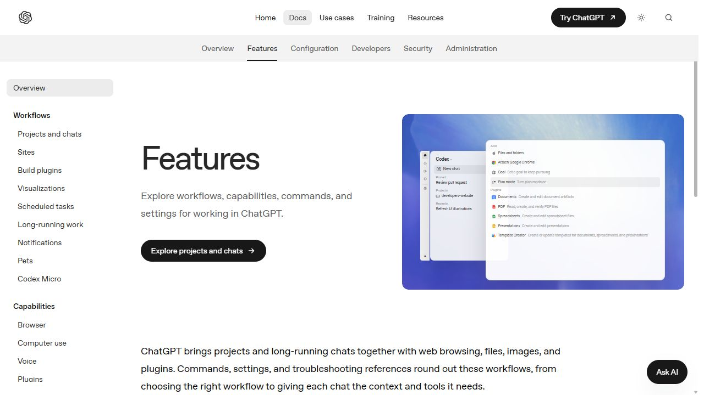
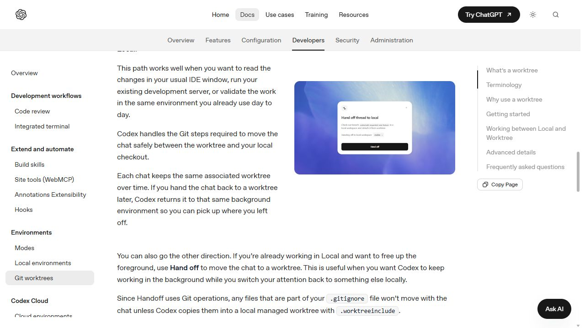

# Codex app 產品介面研究

> 查閱日期：2026-10-02（Asia/Taipei）。本稿研究公開官方文件與官方介面示意，未讀取使用者的私人聊天、日誌或 Codex 本機資料，也未宣稱實測目前安裝的 client。

## 研究結論

Codex 的產品模式是把「選擇執行環境、追蹤多項工作、介入決策、檢查結果」放在聊天旁邊。這是由公開介面與文件歸納的設計解讀，而非官方宣稱的產品原則。Kairomes 可優先借用這些決策節點，讓 ChatGPT 旁的窄側欄回答：目前操作哪個專案、正在做什麼、何時需要我、做完如何查驗。Kairomes 的現行定位依 [README](../../README.md) 是本機工具橋接與側欄核准，因此完整複製 Codex 的聊天列表或 IDE 不是本稿建議。

「Hand off」值得規劃，但要區分含義。官方 Codex 文件描述的是同一個聊天與程式碼在 **Local／Worktree** 間移動。使用者希望的 **Codex → ChatGPT + Kairomes** 是跨產品接續，應先以可預覽、可驗證的交接包設計，不承諾移轉原模型上下文、執行中的程序或原本核准狀態。[官方 Worktrees 文件](https://learn.chatgpt.com/docs/environments/git-worktrees#option-2-handing-a-chat-off-to-local)

## 來源、方法與限制

先以本機公開 README 確認 Kairomes 定位；Codex 產品事實則以實際開啟的 OpenAI 官方頁面與官方頁內 WebMCP 文件查詢為依據。來源限定 `developers.openai.com`、`learn.chatgpt.com` 與 `platform.openai.com`，未使用社群轉述作為功能依據。

此次實際開啟 `developers.openai.com/codex/app/`、`app/features/`、`app/worktrees/`、`app/review/`，分別重新導向 ChatGPT Learn 的 desktop app、Features、Worktrees 與 Code review 頁。現行官方文件同時描述 ChatGPT desktop app 與其中的 Codex 體驗。文件命名、公開示意與使用者安裝版可能不同；查閱日期和文章發布日期都不是 client 版本證明。[官方 desktop app 頁](https://learn.chatgpt.com/docs/app)

證據分成三類：

- **V：實際看過的官方公開畫面**。這次看到的是官方文件中的介面示意，並保存所在頁面截圖。官方文件查詢返回 `CodexScreenshotPresentation`、`Illustration` 等元件，故明確標為官方重建示意，不能當作原生 app 實測截圖。
- **D：官方文件描述**。支持操作語意與功能邊界；不單憑文字推斷精確位置、尺寸或視覺狀態。
- **I：設計推論／Kairomes 建議**。由 V、D 與 Kairomes 定位推導，仍需使用者測試或原型驗證。

| 編號 | 官方來源 | 本稿用途 | 限制 |
| --- | --- | --- | --- |
| S1 | [ChatGPT desktop app](https://learn.chatgpt.com/docs/app) | 產品入口、Codex／ChatGPT 選擇 | 文件描述，非安裝版本資訊 |
| S2 | [Features](https://learn.chatgpt.com/docs/features) | V：導覽與 Add 選單示意 | 官方 HTML/CSS 重建示意 |
| S3 | [Projects and chats](https://learn.chatgpt.com/docs/projects?surface=app) | 專案、聊天、共用上下文 | 不同 surface 操作有所不同 |
| S4 | [Codex environments](https://learn.chatgpt.com/docs/environments/modes) | Local／Worktree／Cloud | 環境可用性仍受設定影響 |
| S5 | [Worktrees](https://learn.chatgpt.com/docs/environments/git-worktrees) | V：Hand off；D：Git 與環境接續 | 需要 Git repository；不是跨產品遷移 API |
| S6 | [Long-running work](https://learn.chatgpt.com/docs/long-running-work?surface=app) | Goal 進度、暫停、續行 | 未實測本機 Goal 生命週期 |
| S7 | [Notifications](https://learn.chatgpt.com/docs/notifications?surface=app) | Activity 與需要注意的狀態 | 部分入口以「when available」描述 |
| S8 | [Sandboxing](https://learn.chatgpt.com/docs/sandboxing?surface=app) | 核准控制、技術隔離與核准政策 | 不等同 Kairomes 的主機命令權限 |
| S9 | [Code review](https://learn.chatgpt.com/docs/code-review?surface=app) | Diff 範圍、行內回饋與 Git 動作 | 未執行 stage／revert／commit |
| S10 | [Work with files](https://learn.chatgpt.com/docs/artifacts-viewer?surface=app) | 產出預覽、檔案、註記 | 不同格式／surface 支援不同 |
| S11 | [Browser](https://learn.chatgpt.com/docs/browser?surface=app) | 預覽、視覺回饋與明示權限 | 不支持把所有本機 URL 視為安全 |
| S12 | [Prompting](https://learn.chatgpt.com/docs/prompting) | Steering／Queue 與上下文 | 不代表 Kairomes 可控制 ChatGPT composer |
| S13 | [Import from another agent](https://learn.chatgpt.com/docs/import) | 選擇性匯入、需完成連線設定 | 官方匯入能力不等於第三方可用 API |
| S14 | [Use ChatGPT：Codex thread snapshot](https://learn.chatgpt.com/docs/use-chatgpt#share-a-read-only-snapshot-of-a-codex-thread) | 唯讀分享與附件接續的限制 | 此段明載 macOS；不假設 Windows 相同 |

所有 S1–S14 均於 2026-10-02 查閱。參考頁可能更新；實作前應重新核對相關官方文件。

## 可見畫面證據

### V1：導覽與 Add 選單

畫面來源：[官方 Features 頁](https://learn.chatgpt.com/docs/features)。此截圖保存公開文件頁與頁中的官方重建示意，並非使用者私人 app。

實際可見元素包括窄圖示列、Codex 選擇、New chat、Pinned、Projects、Recents，以及 Add 面板中的 Files and folders、Attach Google Chrome、Goal、Plan mode 和 Plugins。其設計把「啟動工作」與「加入能力」集中在少數入口，日常導覽留給專案和工作。畫面只能支持元素與相對布局，不能證明所有功能在每個帳號、平台或版本都可用。

### V2：Hand off 對話框

畫面來源：[官方 Worktrees 頁的 Local 交接段落](https://learn.chatgpt.com/docs/environments/git-worktrees#option-2-handing-a-chat-off-to-local)。公開示意可見 `Hand off thread to local`、目標本機工作區與 `Hand off` 動作，旁邊的文件交代接續 Git 工作內容的語意。這是官方環境切換示意，無法證明支援 ChatGPT 網頁或 Kairomes 作為目的端。

## UI／UX 模式與 Kairomes 可採用的部分

| 面向 | Codex 的官方模式與依據 | 可轉用的設計推論（I） | Kairomes 必須保留的邊界 |
| --- | --- | --- | --- |
| 任務入口 | 先選 Codex 與執行環境，再送出需求；Add 集中補充檔案與能力。S1、S2、S4 | 先顯示已選專案、連線與核准模式，再提供「開始／接續」所需最少資訊 | 側欄不代使用者送出 ChatGPT 訊息 |
| 專案／聊天導覽 | 專案承載共享檔案與指引，每個不同成果用獨立聊天；Pinned、搜尋與 archive 管理注意力。S3 | 先以 Kairomes 操作／任務分組，支援搜尋、釘選與完成封存；標題描述成果 | 沒有官方聊天存取能力時，不建立假冒 ChatGPT 聊天列表 |
| 執行環境 | Local 直接操作專案；Worktree 隔離 Git 變更；Cloud 使用設定的遠端環境。S4 | 使用者應一直知道「哪個專案／哪個工作目錄／在哪裡執行」 | Kairomes 目前本機工具不得被文案包裝成 OS sandbox 或 Cloud |
| 執行狀態 | Goal 有進度列與暫停／續行；Activity 關注未讀、執行中與待回覆。S6、S7 | 把「執行中、待核准、失敗、已完成可檢查」拆開；停止或取消要說明效果 | MCP 工具事件與模型整體任務狀態不同，無證據時不可宣稱模型完成或已停止 |
| 權限核准 | composer 下方有 permissions 控制；官方區分技術 sandbox 與 approval policy。S8 | 核准卡呈現實際動作、目標、範圍、有效時間與撤回入口；模式狀態常駐可見 | 可信本機管理面才能核准；模型與 widget 不得取得管理權杖 |
| Diff／review | 審查面板有多種比較範圍，行內回饋連到精確程式碼；可處理檔案與 hunk。S9 | 窄側欄先顯示變更摘要與檔案清單，點入詳細 diff；回饋保留檔案、版本與位置 | 「本次操作改了什麼」與「整個 Git working tree」必須明確分辨 |
| 產出／預覽 | 成果在聊天旁預覽，可透過註記要求修訂。S10、S11 | 將產出檔案、驗證結果與開啟方式放在同一張成果卡；之後再加入區域註記 | 只預覽允許的內容與來源；任意 HTML、私人 URL、檔案載入不能自動擴權 |
| 上下文 | 專案共享來源、當次附件與持久指引各有不同用途；新訊息可 steer 或 queue。S3、S12 | 「這次已提供的資料」應可檢查；交接包列出需求、決策、驗證與未完成事項 | 不讀 Cookie、聊天 DOM、日誌或逐字稿來偷補上下文 |
| Handoff | 原生 Hand off 處理 Local／Worktree 的同一聊天與 Git 內容。S5 | 跨產品交接應先驗證目的工作區與版本，顯示接續前後的差異 | 不繼承原 agent 的核准、不自動接管原程序、不宣稱原 thread 被原地延續 |

表格的 Kairomes 欄都是建議，不表示功能已實作；目前功能仍以根目錄 README 與程式碼為準。

## 使用旅程的設計解讀

**開始**：使用者表達成果，確認專案、執行環境與能力。**進行**：產品持續顯示進度，僅在需要判斷時凸顯決策。**檢查**：使用者查看實際檔案、diff、測試或預覽，再給精確回饋。**接續**：保留成果、未完成事項及工作環境，使下次工作有可信起點。這四個階段是本稿由 S2–S12 歸納的設計框架。

對 Kairomes 的直接啟示是：窄側欄首屏應容納「目前範圍＋最需處理的一件事＋進行／成果摘要」。細節向下展開或另開檢查頁。不能只列大量工具事件，迫使用者自行從事件流推測風險、成果與下一步。

依使用者的明確要求，UI 嚴禁大量或重複敘述。每個主要區塊預設只顯示 **短狀態＋必要資訊＋動作**；同一狀態不在頂部、卡片與頁尾反覆解說。一般完成卡可用「已完成 · 3 個檔案」「查看變更」；待核准卡可用「等待核准」「修改 2 個檔案」「核准／拒絕」，但必要的命令、範圍及主機權限仍必須可供核對。完整事件、錯誤堆疊、研究理由、技術機制與復原步驟按需展開，不能把本研究稿的敘述直接貼進產品介面。

## Codex → ChatGPT + Kairomes 的交接判斷

| 流程 | 官方已建立的語意 | 對 Kairomes 的含義 |
| --- | --- | --- |
| 原生 Hand off | 同一 Codex 聊天與 Git 工作內容在 Local／Worktree 間切換。S5 | 可借用「目的環境明示＋檢查 Git 狀態」模式；無直接跨產品 API 證據 |
| 官方外部 agent import | 可選來源與項目；支援的設定與近期工作匯入後，部分連線仍需完成設定。S13 | 可借用「先選內容、檢查相容性、顯示完成與待處理」模式 |
| Codex shared snapshot | 唯讀固定快照，可作新 thread 附件；不能 fork 原 thread，不包含原工具呼叫／輸入／輸出。S14 | 不適合作為完整執行交接；也不應以公開 share link 作預設 |
| Kairomes 交接包（提案） | 本稿提案，非官方既有功能 | 以使用者主動匯出的文件和選定工作區為起點，先驗證後接續 |

建議納入後續規劃，優先級低於基本連線、核准與變更檢查的可信度改善。最小流程為：

1. **產生交接包**：由來源 agent 在使用者指定的專案內生成可讀文件，包含目標、限制、已完成／未完成、重要決策、選定檔案、Git 基準與驗證狀態。以明示清單決定內容，不掃描私人 app 資料。
2. **本機匯入預覽**：Kairomes 顯示來源、生成時間、檔案清單與目的專案；驗證相對路徑、可掛載範圍、版本與內容大小。不自動執行包內指令。
3. **核對接續範圍**：使用者處理 Git／檔案差異或過期資料，確認下一個可驗證成果。原有核准與自主模式不能成為匯入授權。
4. **交給新聊天**：使用者取得安全的接續文字與交接檔，在 ChatGPT 自行送出；ChatGPT 透過既有 Kairomes MCP 工具按需讀取已選範圍。
5. **驗收接續**：新 agent 先讀交接包、核對實際專案並回報差異，之後才依當前核准機制執行下一步。

必要性應由使用者研究驗證：是否經常在 Codex 完成初步開發後，轉到 ChatGPT 做分析、文件、視覺產出或延伸工作；重新交代需求是否反覆且昂貴；交接包能否保留足夠決策且不挾帶不必要資料。本稿沒有官方依據可保證原 Codex thread、隱藏上下文、tokens、工具進程或 agent 身分可被 Kairomes 連續移轉。

## 可寫入 reusable skill 的規則

以下規則適合成為 agent 工作型產品設計 skill 的 Codex 參考章節；它們是本稿的設計推論，不是對官方元件的複製要求：

- 每個結論標記「看到的畫面、文件描述、設計推論」與查閱日期。
- 每條主要流程都先定義專案／執行範圍，並使使用者可隨時確認。
- 把工具事件、agent 狀態、連線狀態與待核准事項當成不同資料。
- 把核准設計在實際動作旁，呈現範圍、後果、到期與撤回。
- 完成狀態連到可檢查的成果與驗證結果，不能以漂亮訊息代替證據。
- 將 review 回饋定位到實際檔案、版本或畫面區域。
- 採用窄側欄時，以決策與成果摘要優先，完整事件與 diff 按需展開。
- UI 預設使用「短狀態＋必要資訊＋動作」，刪除重複敘述；不得將研究解說或完整技術背景塞進介面。
- 交接必須交代接續什麼、缺少什麼與需要重新核准什麼；輸入的交接內容不能自行授權。
- 不將競品的原生能力推定為可對第三方使用的公開 API。

## 後續驗證項目

這份公開研究足以形成原型假設，但不能取代 Kairomes 使用者驗證。後續原型至少檢查：初次配對、斷線重連、正在等待核准、批次檔案變更、命令失敗、過期 diff、未知 agent 任務狀態、交接資料過期、交接範圍不匹配與使用者撤回權限。觀察使用者能否在側欄辨識當前範圍、解釋待核准動作、找到成果並知道下一步；不得把上述能力視為研究已證明。
