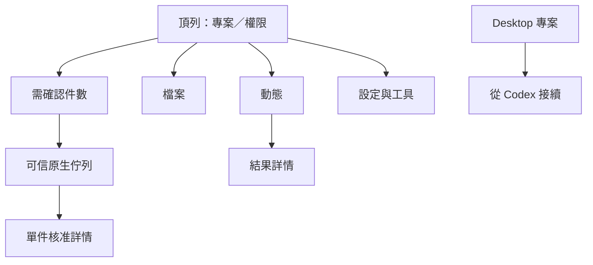

# Kairomes 側欄後續開發計畫

規劃更新：2026-10-03。原研究基準：`0.1.4`、revision `5edf3dcb61eb5021135ccf200f0aa7af97ddceb1`。狀態：**D01～D09 已有程式碼與合成證據；實機相容仍待驗證，D10 是後續選用研究，H2／P2 仍是條件方案**。當次修改與檢查詳見[實作報告](implementation.md)，不能以本計畫推斷已發布。

依據：[README](../../README.md)、[CONTRIBUTING](../../CONTRIBUTING.md)、[SECURITY](../../SECURITY.md)、[現況盤點](kairomes-current-state.md)、[官方研究與模式](agent-app-patterns.md)、[畫面檢視](sidebar-audit.md)。交接契約見 [handoff-spec.md](handoff-spec.md)。第二輪的失敗恢復、取消及無障礙修補見 [續作紀錄](continuation.md)。

## 1. 產品決策與優先順序

本輪已保留品牌、工具橋接與可信核准層，縮減窄版資訊密度，加入成果檢查與 H1 接續。下列規格保留原驗收要求；程式碼與合成檢查的落地範圍列於第 9 節，尚未完成的使用者目標仍需驗證。

使用者的必要約束：**UI 嚴禁大量文字，禁止用不同句子重複描述同一件事。** 適用於正常畫面、空白、核准、設定、錯誤與交接。工程文件可以完整；產品畫面只放當下判斷需要的資訊。

| 階段 | 使用者問題 | 交付範圍 |
| --- | --- | --- |
| P0 | 範圍與核准狀態不明；多卡遮擋；判斷文字難讀 | 精簡頂列、專案選擇、單件核准詳情、狀態去重、閱讀與焦點 |
| P0（第一階段已落地） | Layer 等遠端 MCP 需要 OAuth | 原生登入、取消、未知結果查詢與工具探索已加入原始碼；公開 metadata、合成與建置通過，帳號／原生相容性待驗 |
| P1 | 成果難找或過期；工具難搜尋；換 Agent 重述成本高 | 成果證據、工具搜尋、人工複製交接試點 |
| P2 | 跨重啟、跨來源與並行工作難管理 | 本機工作分組、選用持久摘要、發布包讀取、合作式 lease／worktree 研究 |

暫不列入另一個聊天 composer、模型切換、虛構 context 百分比、完整 IDE、任意網頁預覽、自動 merge 或聊天 DOM 擷取；每項需另外證明使用情境與能力契約。

### 功能與驗證的必要性

2026-10-03 依使用者回饋收斂範圍。側欄的核心是看懂操作、處理核准、檢查成果；不把研究工具或選配交接列成日常使用前提。

| 項目 | 定位 | 本輪處理 |
| --- | --- | --- |
| 文字可讀、鍵盤可操作、焦點與狀態正確 | 基本品質 | 由開發端檢查；不新增「無障礙」功能頁或使用者任務 |
| 多人試用與計時 | 後續研究 | 核心流程穩定後選用，不要求使用者招募或完成 |
| 免安裝預覽 | 內部開發工具 | 只供合成情境重現，不加入產品導覽 |
| Codex → ChatGPT 的 H1 人工交接 | 選配試點 | 已有程式碼；有跨 App 接續需求時使用，不影響一般側欄操作 |
| 自動交接包、持久摘要與 H2 | 尚未證明必要 | 保留提案；先確認人工交接的實際卡點再決定 |

既有操作中的錯專案、舊回覆覆蓋、取消殘留與未知授權重送屬修錯；不以新增入口或常駐說明處理。

## 2. 目標旅程與後續成效研究

多人試用與計時用來評估設計成效，不作為本輪程式碼開發的完成前提。免安裝預覽留在內部工程環境；一般使用者直接使用產品並回報卡點即可。基本可讀性、鍵盤操作與安全判斷保留為介面品質要求。

| 旅程 | 預期行為 | 初步目標，待使用者測試確認 |
| --- | --- | --- |
| 首次連接 | 看見 Extension ID、貼連結、連接；錯誤有一個對應動作 | 五名測試者至少四名不需解釋即可找到下一步 |
| 核准 | 找到請求，理解操作與範圍，選允許／拒絕 | 10 秒內找到待處理請求；至少四名能說出命令與 shell 授權差異 |
| 檢查成果 | 找到 diff／exit code／圖片，辨識待驗證／過期 | 兩個主要動作內開啟可用成果；不把 exit 0 當成目前檔案保證 |
| 中斷恢復 | 發現狀態失效，查目前狀態再決定 | 恢復連線不重送核准或副作用，不因斷線重複執行 |
| Codex 接續 | 審閱來源、補下一步、停止來源、核對版本、貼至 ChatGPT | 五次受控接續至少四次能在兩分鐘內準備必要上下文；敏感資料零自動外傳 |

以上數字是後續研究假設，不是現有量測結果。使用合成或明確允許的專案資料；不預設加入遙測，不收集聊天、命令輸出或工作區內容。正式研究時主持人只記錄時間、操作與誤判。

## 3. 資訊架構

400px 預設一個閱讀區。頂列放完整專案短名、有效操作權限與連線異常；主區為「動態」，另有「檔案」與設定內的「工具」。待處理入口是件數；點入後，由可信 Extension 呈現佇列與單件詳情。

360～480px 移除常駐 initials rail，改專案選擇器，回收約 58px。選擇器能看全名；長名稱不擠掉權限、返回或核准入口。寬視窗可保留 inspector，側欄不用三欄。

選專案只改瀏覽與核准篩選，**不改 ChatGPT 工具目標或 grant 範圍**。按 `workspaceId` 篩選，缺少 ID 的事件留在「其他本機操作」。切換後仍顯示全實例待處理總件數，並有「全部」入口，避免隱藏其他專案的等待請求。不能用目前網頁聊天推定事件歸屬。

## 4. 文字與資訊分配

| 畫面 | 預設可見 | 按需顯示 | 禁止的重複 |
| --- | --- | --- | --- |
| 頂列 | 專案、權限短標籤、異常短狀態 | 連線層級、範圍、期限 | 頂列和頁尾同時說已連線 |
| 動態列 | 操作名稱、一次狀態、查看 | 輸出、參數、技術資料 | 標題、摘要與段落重述操作 |
| 核准佇列 | 操作、目標短名、狀態 | 單件判斷欄位、diff／argv | 每列都放完整權限教學 |
| 單件核准 | 精確操作、目標、範圍／期限、允許／拒絕 | 次要技術資訊 | 多種措辭反覆說同一風險 |
| 空白／錯誤 | 一句狀態、一個復原動作 | 使用指南或診斷 | 介紹卡；alert、toast、卡片重複錯誤 |
| 接續 | 目標、下一步、來源短標記 | 覆蓋範圍、版本、編輯 | 所有歷史 turns 預設全展開 |

一般列建議只有標題與一行 metadata。核准依複雜度保留必要欄位，不以固定行數藏掉決策資料。出現重複事實、長介紹或第二份摘要，即不通過文案驗收。

| 情境 | 短文案與動作範例 | 必須保留的意思 |
| --- | --- | --- |
| 尚未配對 | `連接工作台`、`貼上配對連結` | 取得方式只有一個說明入口 |
| 待核准 | `需確認 3` | 件數是 pending 請求，不是所有未完成操作 |
| 一次命令 | `執行檢查`、完整 argv、`主機權限・可連網`、`最多 120 秒`、`允許這次`／`拒絕` | 可查解析後執行檔與精確 cwd；工作區外存取不受隔離 |
| 終端機 | shell、位置、`主機權限・15 分鐘`、`允許 15 分鐘` | 允許整個 shell，能操作工作區外與連網 |
| 結構化變更 | `修改 2 個檔案`、路徑／操作、`查看差異`、`套用`／`拒絕` | 同一批與版本檢查一致 |
| 結果未知 | `結果待確認`、`查詢狀態` | 沿用 request ID，不重送 |
| 詳情過期 | `詳情已到期`；適用時 `重新讀取` | 新讀取不是歷史結果 |
| 全自主 | `全自主・14:30 到期`、`收回` | 決策時可見主機權限與同實例範圍，不說只限此聊天 |
| 交接 | `從 Codex 接續`、`複製接續內容` | 複製不等於發送或接手成功 |

數字是範例，實際值由資料計算。shell 的必要權限短句清楚包含「可操作工作區外／可連網」，不只放難懂的主機權限標籤。不提供「全部允許」，不自動勾選擴權選項。

## 5. P0 功能規格

### P0-01 頂列與範圍

重用 workspaces、PanelSnapshot 與現有連線資料。正常狀態只有一個短入口；詳細頁區分核准通道、工作台資料、Tunnel／宿主未知。只取得本機資料時，不能說 ChatGPT 已連接。

驗收：400px 長名稱不擋權限；401／403 顯示重新配對並停用核准；舊式網址標為僅可瀏覽；非最新快照標 stale。配對碼與 panel token 不進 iframe／模型。grant 保留目前期限與實例／workspace 語意，全自主的範圍要常駐可查。

### P0-02 可信佇列與單件核准

修改 [ApprovalPanel](../../apps/extension/src/approval-panel.ts)、[approval-state](../../apps/extension/src/approval-state.ts)、[sidepanel](../../apps/extension/src/sidepanel.ts) 與 CSS。預設短列，點一件才進原生詳情；不再十張浮層疊在 iframe 上。保留返回位置與焦點。

核准綁原 request ID、fingerprint 與不可變內容。詳情顯示解析後執行檔、分開的 argv 元素、cwd、範圍與期限；長欄位可展開或換行，執行前能核對全部精確內容。diff 太長時必須明示截斷，不能把省略版當成完整審閱。

現行可信 panel 已回傳 prepared 的完整 diff，直接重用，不需要新增完整差異端點。core 超過 192 KiB 即拒絕整批並要求拆批；一般 MCP／iframe poll 的裁切結果不能代替可信核准資料。若未來收到截斷或不完整資料，保留拒絕／取消，不標完整審閱。沿用 [完整審查上限測試](../../packages/workspace-core/src/changes.test.ts#L141)。

驗收：1／3／10 件入口一致；內容改變、到期、取消、重啟讓舊決策失效；斷線停用按鈕；未知結果先查狀態。卡片退出後焦點回下一件或佇列標題。命令、shell、檔案套用語意清楚。modal 有焦點限制與 Escape，頁面有正常順序；fingerprint 不傳 iframe。

### P0-03 狀態去重與閱讀鎖定

重用 `ActivityEntry.id／focusSeq`、result 關聯與 `following`。使用「本機操作」語意，每筆只有一次狀態。開歷史詳情後新事件只更新未讀件數，不搶內容或焦點；人按「最新」才恢復跟隨。

驗收：同一操作不跨層重複長敘述；output 增量不創造假任務；arrival order 不勝過 seq；選中專案不改事件歸屬。停止程序與停止觀看動態分開。

### P0-04 Setup、錯誤與無障礙

setup 保留 Extension ID、配對輸入、一個主動作與一個短說明入口。錯誤依未配對、失效、離線、未知結果給一個對應動作。診斷不顯示私人 URL／憑證；不自動重新核准。

驗收：360／400／480px、200% zoom、長 argv／diff、十件核准可讀；核心判斷文字至少 14px；正文對比目標 4.5:1；操作目標至少 24px、建議 32px。鍵盤返回、popover、卡片消失、讀屏 status／alert、reduced motion 皆受控測試，不只看截圖。

## 6. P1 新功能

### P1-01 成果證據與到期狀態

使用現有 command、file_change、artifact、result ID。完成列連到實際 diff／版本、命令 exit code／輸出完整性、圖片身份。沒有可靠關聯時，只標「執行時結果」，不說目前版本通過。

驗收：exit 1 不成功；exit 0 仍需讀至 `output_complete` 且無 `has_more`；truncated、unknown、pending、expired 分開。圖片可核對相對路徑與 version；重啟／過期不偽造結果；重新讀檔不覆寫歷史驗證主張。預設不保存原始輸出，不新增虛構任務進度。

### P1-02 工具搜尋與啟用範圍

在 [McpPanel](../../apps/extension/src/mcp-panel.ts) 加本機搜尋、server／tool 篩選。短列放名稱與開關，描述點入才看；使用單一主要捲動區。下游風險標示仍是參考。

第一版不改目前「新增後所有工具立即開啟」政策。若測試支持先選再啟用，另開政策 PR，包含預設啟用遷移、catalog revision 與公開文件。驗收 27／100 工具可找回；失效不標 ready；revision 改變重讀 describe；管理仍限可信本機。

本輪先補 stdio 初始化等待、未知新增結果查詢與通知布局，見 [MCP 連線與恢復](mcp-connection-recovery.md)。後續已加入直接 HTTP OAuth，見 [第一階段實作紀錄](mcp-oauth-implementation.md)。既有 stdio 橋接仍可使用，不把連線失敗當成保存失敗或登入進度。

依 [MCP OAuth 開發規格](mcp-oauth-plan.md) 已完成當次啟動期間的原生流程：名稱／網址加入，可信側欄明確登入，callback 成功後重新探索工具。O00／O04 的真實 Layer 與原生側欄驗收仍待完成；跨重啟記住登入 O05 為 P1，另接系統憑證儲存。完成登入不自動重送之前的工具呼叫，Layer 實際相容性是發布前的必要驗收。

### P1-03 H1 人工交接

已實作小範圍 H1 試點：入口位於 Desktop 專案動作，Desktop 選來源、編輯、預覽並複製；有效授權核對仍在原生側欄。第一批沒有側欄接續摘要卡或複製入口，先把完整審閱集中於可信 Desktop，維持側欄的閱讀空間。從有限歷史與人補的目標／下一步建立上下文，核對停止聲明與相關檔案後複製。接收端先唯讀是流程要求，純文字不構成後端限制；若要禁止自動執行，由人在原生側欄主動收回既有 grant。沒有 DOM 發送、新 grant 或程序搬移。

具體流程、範圍、dirty／non-Git 策略與驗收見 [交接規格 H1](handoff-spec.md)。沒有改善重述或可靠核對，就保留 CLI 並延後 H2。

## 7. P2 啟動條件

| 提案 | 何時值得做 | 必須解決 |
| --- | --- | --- |
| 本機工作分組／釘選 | 多次工作難找回 | 人為 work_item ID 不能當聊天身份或權限隔離 |
| 持久成果摘要 | 跨重啟找結果有價值 | 最小 metadata；保留／刪除政策；不存原始輸出／聊天 |
| H2 發布包讀取 | H1 成功且複製成為瓶頸 | digest、workspace 綁定、期限、撤回、失敗 schema |
| 合作式 writer lease | 多 writer 都能加入協定 | 外部 Codex／自由主機 shell 不受強制約束 |
| Worktree 管理 | Git 並行衝突常見 | dirty／未追蹤檔、搬移衝突、非 Git fallback、可信管理面 |
| 結構化變更回復 | 人需要撤回批次 | current hash 等於 after version；不復原外部副作用 |
| MCP App 傳接續文字 | 真實宿主 capability 與 E2E 成功 | 人主動送出、未知收件不重送、保留草稿 |

## 8. 技術責任與安全邊界

| 層 | 責任／重用資料 |
| --- | --- |
| `apps/extension` | 頂列、原生核准、權限與工具管理；PanelSnapshot／AccessPanel／ApprovalPanel |
| `apps/widget` | 專案瀏覽、動態、單閱讀區、結果詳情與閱讀鎖定；main／ActivityPanel／OverviewPanel |
| `apps/daemon` | 指紋、結果可用性、來源 reader 與有限詳情；preview／activity／agent-sessions／codex-rpc |
| `packages/protocol` | 真正需要時新增可用性／交接 strict schema |
| Desktop／CLI | H1 來源選擇、編輯與 child 生命週期；handoff／IPC／sidecar |
| 公開文件 | 使用方法、現行行為、限制與撤回；README／CONTRIBUTING／SECURITY |

P0 先使用現有資料，避免同時改權限政策。跨原生層／iframe 的導覽訊息只接受枚舉意圖，檢查精確 origin、window、type；不接受代核准、token 傳遞或開啟自主模式。workbench 沒有 ChatGPT sendMessage 能力；embedded MCP App 仍需宿主 capability。

不相容 UI resource 更新 `WIDGET_URI`；新 tool／schema／權限同步測試和公開文件。持久資料另訂 migration／保留政策。

## 9. 可拆分工作與驗收矩陣

以下保留拆分規模與 Done 條件，新增目前證據狀態；本輪尚未宣稱建立獨立 PR 或發布。D01～D09 已有程式碼、相關自動檢查與合成畫面／互動；實機相容項目另記限制，D10 留作後續研究，不阻擋其他已授權的開發工作。

| 工作 | 優先級／規模 | 依賴 | Done 條件 | 目前證據狀態 |
| --- | --- | --- | --- | --- |
| D01 文案與窄版 fixture | P0／小 | 無 | 360／400／480、長名、3／10 核准、空白／斷線基準圖 | 程式碼／合成畫面；真實斷線圖與實際側欄待驗 |
| D02 頂列／專案選擇 | P0／中 | D01 | 來源正確、權限不消失、待處理總量可找回 | 全名選擇器、全實例件數、可信導覽；合成檢查 |
| D03 原生單件核准 | P0／中 | D01 | 指紋不變、完整閱讀契約、內容變更／到期／unknown 失敗案例 | 短佇列／單件詳情與失效檢查已落地；真實配對待驗 |
| D04 去重／閱讀鎖定 | P0／中 | D02、D03 | seq／result 正確，不搶焦點，無說明段落 | 概要與內容固定、未讀、返回焦點、延遲回應失效；合成互動 |
| D05 Setup／錯誤／A11y | P0／小 | D02～D04 | 一個復原動作，鍵盤／縮放／對比驗收 | 必要文字、焦點與局部對比修補；15 個窄版尺寸及 CSS 動態分支檢查，真 200%／完整對比／讀屏／真偏好待驗 |
| D06 成果與到期 | P1／中 | D04 | exit／版本／完整性正確，不混成任務完成 | 執行時證據、完整性、到期／失效顯示與測試 |
| D07 工具搜尋 | P1／小 | D05 | 100 項可找回、單主捲動區、政策不變 | 名稱／描述搜尋、伺服器／工具篩選、按需說明；合成資料 |
| D08 H1 來源與編輯 | P1／中 | D02、D05 | allowlist、敏感預覽、coverage 清楚 | Desktop 兩階段、來源覆蓋及合成來源；已安裝 CLI 隔離空清單握手通過，真來源／Tauri 待驗 |
| D09 H1 核對／複製 | P1／中 | D06、D08 | 停止聲明、dirty 身份、invalid 不 ready、複製不等於發送 | 有限文字檔基準、digest、複製前重驗、人工確認；受控測試 |
| D10 H1 使用研究 | 後續選用／小 | D09 | 比較重述時間／版本正確率，決定 H2 | [主持腳本、雙組材料與獨立控制](usability-test.md)已準備；239 項工程回歸及材料互動驗證，真人未測 |

詳細變更、測試及畫面均連回[實作報告](implementation.md)。合成頁面不使用真實配對、使用者聊天或主機命令；畫面與 handler 的檢查不能代替原生 Extension 載入、實際 Host／Tunnel／ChatGPT、螢幕閱讀器或真人任務成效。

D05 的最新量測、字級／樣式修補與隔離 CLI 相容範圍見[可讀性與相容檢查](readability-audit.md)。空來源清單不支持真來源 coverage；可讀性抽樣不關閉完整無障礙門檻。

| 情境 | 必須觀察的結果 | 驗證層 |
| --- | --- | --- |
| 斷線但 iframe 有舊資料 | 核准停用、資料 stale，重連只取快照 | panel HTTP＋browser |
| 核准 timeout／回應丟失 | 同 ID 查詢，不重送 approve／command | Extension＋daemon |
| 十件核准、一件停止中 | 順序穩定、單件可讀，stop 不叫回復 | UI＋程序生命週期 |
| 兩來源交錯 | 不說「此聊天」，workspace 篩選正確 | 合成 activity＋protocol |
| 200% zoom／長 argv／diff | 資訊與動作不被擠掉，完整內容可讀 | browser＋鍵盤＋讀屏 |
| 結果淘汰／重啟／到期 | 不偽造歷史輸出 | activity store＋UI |
| HEAD 相同但檔案變了 | stale、先唯讀、不 ready | handoff 失敗測試 |
| 來源仍工作／包內惡意指令 | 本機不標可接手；接收不執行包內指令是受控 Agent 驗證，非本機門禁 | adapter＋接收 Agent |

## 10. 發布與品質

程式變更執行 `bun run check`；涉及 Desktop／Tauri／sidecar 加 `bun run desktop:check`，Rust 依貢獻指南完成格式與 clippy。權限、路徑、preview、程序變更加入失敗案例。

目前已進入程式碼與受控 fixture 驗證，逐項證據見[第四輪稽核](completion-audit.md)、[可讀性檢查](readability-audit.md)與 [D10 材料準備](usability-test.md#7-工程準備紀錄)。使用者選擇先不安裝 Extension，原生驗收保留待辦；取得明確授權後完成原生 Chrome／Edge 側欄、200% 縮放、螢幕閱讀器與真實 Tunnel／ChatGPT 路徑，未測平台如實記錄。正式多人研究另行安排，合成與原生階段分開計分，不要求一般使用者執行免安裝預覽或招募測試者；H2、lease、持久工作模型依實際需求與啟動條件另決策。
