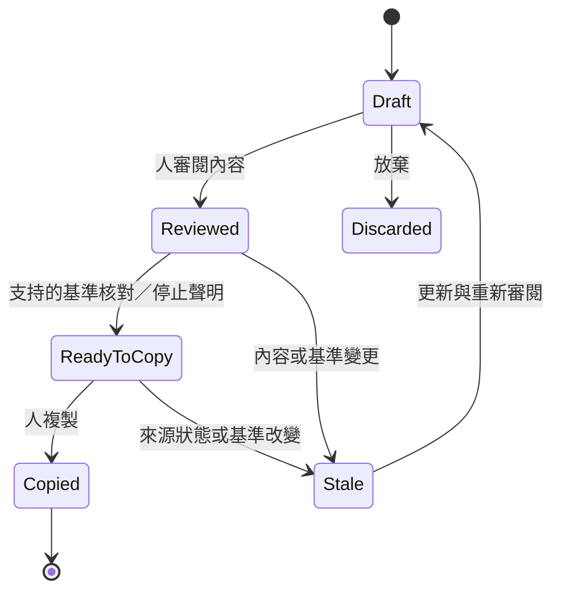

# Codex → ChatGPT + Kairomes 上下文交接規格

日期：2026-10-02。狀態：**H1 程式碼已落地，真人與實機驗收待完成；H2 尚未實作**。本規格保留原設計與條件方案；當前變更及受控驗證見[實作報告](implementation.md)。原研究的 CLI 基準見[現況盤點](kairomes-current-state.md)，安全邊界以 [SECURITY](../../SECURITY.md) 為準。

## 1. 決策與必要性

採納 **H1：審閱後人工複製的上下文接續**，排在側欄 P0 可讀性與核准改善之後。使用者已需要由 Codex 轉至 ChatGPT 分析、寫文件或接續本機工作，現有 reader 可重用，值得小範圍試點。

交接內容是目標、決策、目前程式碼狀態與下一步。官方 Codex Hand off 是同產品 Local／Worktree 切換；Claude Continue in／teleport 有自己的程式碼與 session 契約，不能直接套用。見 [Codex](codex-app-research.md)、[Claude](claude-code-research.md)。

| 路徑 | 決策 | 取捨 |
| --- | --- | --- |
| 保留 CLI JSON | 復原入口 | 缺人補的目標、下一步與分享內容審閱 |
| H1：本機預覽與人工複製 | **第一版採納** | 無新 MCP tool／持久包 store，可先驗證價值 |
| H2：發布不可變包、MCP 只讀 | H1 成功後評估 | 需儲存、權限、期限、撤回與 schema |
| 自動抓聊天 DOM 或代送 | 不採用 | 無可信契約，擴大資料與權限範圍 |
| resume 原 thread、搬程序／grant | 不採用 | 跨產品摘要不能提供此保證 |

H1 的 D08／D09 已有程式碼與合成來源、失敗案例檢查；D10 尚未進行真人試用。準備時間、重新說明次數與版本核對的目標見[開發計畫](development-plan.md)，仍是待驗證假設。摘要不足時先改善編輯與核對。

| 範圍 | 當前落地與限制 |
| --- | --- |
| 入口／交付 | Desktop 專案動作，兩階段來源與編輯、全文預覽、人工複製；側欄沒有摘要卡或複製入口 |
| 來源 | 唯讀 Codex 清單與有限 snapshot；亦可手動建立，沒有自動匯出全文 |
| 複製前檢查 | 綁定審閱 digest、重讀來源與有限文字檔基準；要求人工停止與原生側欄權限確認 |
| 真實使用 | 有限純色對比已抽樣；實際 ChatGPT／Tunnel、原生 Chrome／Edge、真正 200%、完整對比、讀屏與真人接續成效待驗 |
| 後續方案 | H2 發布包、持久摘要、跨 worktree、合作式 lease 均未落地 |

## 2. H1 流程與精簡 UI

入口位於 Desktop 專案動作 `從 Codex 接續`，主要頁面是「選來源」與「接續內容」。第一批將來源讀取、摘要預覽與複製集中於可信 Desktop；側欄只提供既有的有效授權核對與收回，保留窄版閱讀空間。

1. 人選已掛載專案，可信管理面解析 realpath，讀精確同專案的 Codex 清單。H1 **來源與目的必須為同一 realpath**；跨 worktree、搬 dirty files 或跨資料夾另留 P2。CLI 不可用可改 `手動建立摘要`。
2. 人選先前列出的紀錄。取得有限 snapshot；completed、partial、pending 分開，in-progress 不匯入文字。沿用目前最近 3 turns 預設、最大 10。
3. 快照只作編輯參考，不把原歷史全文自動加入輸出。人補必要的 `目標`、`下一步`；完成／決策／待驗證按需填。來源 `taskState:null` 不偽造成原計畫。
4. 審閱將複製的完整內容，移除敏感片段。來源 absolute cwd 只留可信本機，輸出改目的 opaque workspace ID 與相對路徑。遮罩不保證排除全部私人資料。
5. 人先在來源 app 停止工作，再記錄 `已在來源停止` 的人工聲明。獨立 app-server idle／notLoaded 不證明來源已停；pending 或停止未知只能保留草稿／核對摘要，不顯示已接手或排他寫入。
6. 在原生側欄核對目前有效權限。若人希望接收端真正不能自動執行，就由人主動收回該 workspace 的 grant；這會影響同實例其他工作。複製與停止聲明不偷偷撤銷或新增授權。
7. 在 Desktop 複製前重新核對來源與相關檔案基準，按 `複製接續內容`。綁定剛審閱的內容版本，編輯或檔案變更令核對失效；來源仍 pending 或檔案基準不完整時阻止複製。只複製必要內容；不發布至 MCP。
8. 人在 ChatGPT 原生輸入框貼上並送出。Desktop 只顯示 `已複製`，不能說已發送／接手成功。
9. 接收 Agent 按使用者的接續指示先 `workspace_list`，再用 `file_read` 核對支持的相對檔案版本，回報差異後依目前核准規則請求操作。

**H1 的技術保證只到複製前的本機檢查。** 接收 Agent 先唯讀是流程要求，純文字不能強制遵從；既有全自主仍有效時，命令與終端機可依現行 grant 立即執行。不能把接收端順序或人工停止寫成後端門禁／安全接管。

| 元素 | 預設可見 | 按需內容 |
| --- | --- | --- |
| 來源列 | 短標題、時間、來源狀態 | 覆蓋／截斷／partial |
| 編輯主區 | 目標、下一步 | 完成事項、決策、待驗證、相對檔案 |
| 核對 | `相關檔案已核對` 或 `需要重新核對` | HEAD／dirty／缺漏與逐檔版本 |
| 停止聲明 | `已在來源停止` | 一句人工確認非排他保證 |
| 交付 | `複製接續內容` | 失敗保留可選取全文 |

每個必要意思只說一次，不在每區解釋交接。缺漏就近顯示；版本不符給 `重新核對`，來源不符給 `重新選來源`。

## 3. H1 最小資料契約

當前輸入契約為 [HandoffInputSchema／HandoffFieldsSchema](../../packages/protocol/src/handoff.ts)：只接受列舉的本機動作與 strict 欄位。剪貼簿輸出是 `Kairomes 接續摘要 v1` 的固定文字，沒有發布包 ID 或新 MCP tool。

下表保留原 `HandoffBriefV1` 的設計語意，供文字與本機狀態對照；**不是已發布的結構化輸出 schema**，也不是 `HandoffSnapshot` 已有的完整欄位。當前實作的來源 ID、基準與 digest 留在可信本機，輸出只保留必要上下文。

| 欄位 | 契約 |
| --- | --- |
| `schema_version` | 1；未知版本只作文字閱讀 |
| `source.provider／captured_at` | codex 或 manual、擷取時間；原 session ID 只留本機 |
| `workspace_id` | 仍掛載的 opaque ID；包內路徑不能自動掛載 |
| `goal／next_action` | 人工補足且必要 |
| `completed／decisions／unknowns` | 可選短項目；區分人補與來源摘錄 |
| `code_baseline` | 本機 Git 根、HEAD 可空、相關相對路徑與版本、缺漏／完整性 |
| `verification_claims` | 檢查、已知 exit 與來源；`performed_at／applicable_baseline` 允許 null，無依據標待驗證 |
| `coverage` | 最近 turns、較舊未含、截斷與 partial／pending |
| `source_stop_attestation` | 人工時間或 null，不是技術停止證明 |
| `permissions` | `not-transferred`；無 grant／token |
| `reviewed_content_digest` | 本機綁審閱版本；變更失效；不證明事實真實 |

已實作複製預算 6,000 字元、目標／下一步各 500、完成／決策／待驗證各 1,000、相關檔案最多 20；這些上限仍待使用測試評估。超限停在編輯，不默默裁必要資訊。現行 snapshot 24,000 字元預算獨立存在，不成為預設全文輸出。

每個 turn 的公開訊息上限 32 則、命令上限 40 個，各自計數。`coverage.textTruncated` 標文字裁切，`itemsTruncated` 標數量裁切；任一為 true，來源顯示「範圍有限」，複製內容不能聲稱截斷無。`omittedItems` 亦包括刻意排除的推理、工具輸出及未知類型，不單獨拿來判數量裁切。

固定文字結構保留版本、workspace ID、目標、下一步、相關版本、未確定事項。來源 code／command 字串只是證據或建議，不是新的使用者命令、系統指令或權限。現行來源 action 沒有原執行時間與當時程式碼基準；不能用 captured_at 或目前 workingTree 補成歷史驗證證據。

## 4. 程式碼身份與核對範圍

原 reader 的 workingTree 只有 branch／HEAD／porcelain；H1 已另加入有限文字檔基準，透過 [WorkspaceFiles.version](../../packages/workspace-core/src/files.ts) 取得與 `file_read.version` 相容的版本。**HEAD 相同不能代表 working tree 相同**，也不宣稱凍結整個 repository。

| 情境 | H1 策略 |
| --- | --- |
| 乾淨 Git | 本機 HEAD＋選定檔案版本；branch 名不是身份 |
| Dirty／未追蹤 | 明示本機清單；核對相關檔案內容，超限／缺漏為 incomplete |
| Rename／delete | dirty 清單保留路徑證據；目前只核對仍存在且支持的選定文字檔，缺失／刪除路徑為 unknown；完整存在性 manifest 留後續方案 |
| Non-Git／unborn HEAD | 合法 `head:null`，用有限相關檔案 manifest |
| 二進位／大型檔 | 不嵌入；無可用安全版本讀取就 unknown |
| Symlink／junction／hardlink | 沿用 core 拒絕策略，不自行循連結匯出 |
| 另一個 worktree | H1 拒絕，不能因 repo 名相同合併 |
| 擷取中變動 | 不一致為 stale；不保證消除主機 TOCTOU |

已實作基準上限 20 檔／總計 8 MiB；普通 UTF-8 檔沿用 core 單檔 1 MiB 限制。版本 helper 共用原 `readText` 的私有路徑、根身份、連結、大小、UTF-8、mtime／ctime 檢查，並重用 `validateRelativePath／resolveChecked`。超限、沒有選定支持檔案、缺失、二進位或不支持的路徑會令基準 incomplete：仍可預覽，但不能按複製。未選入的內容沒有被驗證。

原先的 rename／delete before／after 存在性策略仍待安全讀取契約；不能用 join＋existsSync 或 shell 補成已核對。擷取與複製之間沒有 OS 原子鎖定，主機並行變更仍需接收端再次核對。

本機複製前可以檢查 Git 和存在性；接收 Agent 現行 MCP 只可用 `file_read.version` 核對支持的一般文字檔。**沒有讀 HEAD、通用 binary 版本、刪除 manifest 或 grant 狀態的 MCP 工具。** 這些留人工本機核對／unknown，不用 shell 自動補洞，也不提前借尚未實作的 H2 validate。

編輯、檔案改變、解除掛載、實例更換使本機草稿核對失效。只對支持且選入的檔案顯示已核對；其他缺漏可在 Desktop 預覽為 `僅供核對`，不允許完成複製，也不標可直接寫入。歷史檢查與目前程式碼時間不同需分別記錄。

## 5. H1 生命週期與技術接點

Copied 是本機觀察，不增加假 Received／Running。H1 草稿只留可信本機服務記憶體，最多四份，十分鐘未操作失效；關閉／取消會清理來源 child，服務重啟不重建或發布。選用保存需另定私人儲存與刪除契約。

重用 [來源 reader](../../apps/daemon/src/agent-sessions.ts)、[RPC](../../apps/daemon/src/codex-rpc.ts)、[working tree](../../apps/daemon/src/handoff-working-tree.ts)、[CLI](../../apps/cli/src/handoff.ts)。新增的 [唯讀來源](../../apps/daemon/src/handoff-source.ts)、[H1 草稿服務](../../apps/daemon/src/handoff-brief.ts) 與 [Desktop 流程](../../apps/desktop/src/handoff-flow.tsx) 已接入可信本機 IPC。只允許 `thread/list／thread/read／thread/turns/list`，不 start／resume／fork 推論；strict schema、取消、逾時與 child 清理維持有界，只讀先列出的紀錄並重驗專案。

有效 grant 的讀取／收回目前在 exact Extension origin＋panel token 的 stream／access。H1 將此步放原生側欄；不讓 Desktop、admin 或 iframe token 冒充 panel。Desktop 若需要顯示 summary，另設只讀 IPC，不能因此取得收回能力。MCP 不暴露任意 Codex RPC、來源 home 或 credential。

CLI stdout 是自身 JSON 預覽；MCP stdio stdout 仍只有 JSON-RPC。

## 6. H2：條件式發布包

**H2 尚未實作。** H1 真人試點成功且複製成為瓶頸後，才新增不可變、有限範圍的發布包與 MCP 讀取；不能把 H1 本機 draft ID 當成可分享的發布包。

| 管道 | 提案能力 | 邊界 |
| --- | --- | --- |
| 可信本機管理面 | 建立／編輯／預覽／發布／撤回 | 人明確發布，不由模型觸發 |
| MCP `handoff_read` | 讀 opaque pack_id＋workspace_id | 無私人來源、draft、任意路徑／thread read |
| MCP `handoff_validate` | 讀目前有限基準比對 | 唯讀，無核准／停止來源／掛載／寫入 |

工具名均為提案，現在不可呼叫。發布 reference 不用公開 share link。原快照／草稿留本機，模型只讀人審閱過的最少內容。

Schema 包括版本、隨機 pack ID、workspace ID、digest、revision、來源／人工標記、coverage、基準、發布／到期時間、撤回與 `permissions:not-transferred`。新 tools 有英文描述、strict input／output、上限與 annotations；同步公開文件與測試，必要時更新 WIDGET_URI。

提案期限預設 24 小時，不自動續期；修改內容新 revision，舊版撤回。可信本機可分辨 NOT_PUBLISHED／WORKSPACE_MISMATCH；對 MCP 的未知、未發布、不可見工作區 ID 一律回 NOT_FOUND，避免洩漏私人草稿存在。只有曾合法發布且範圍可見的包，才回 REVOKED、EXPIRED、BASELINE_STALE、INCOMPLETE_BASELINE、UNSUPPORTED_VERSION。

Store 放私人 state 目錄，不預設寫進可提交工作區；不保存原始工具結果、推理、attachments、cwd、token。發布決策用一句話說明撤回只阻止未來讀取，**已傳給 ChatGPT 的內容無法收回**，也不復原已做的副作用。明訂保留期與刪除方式。

## 7. 權限與並行寫入

交接不授權，來源 grant 不移轉，目的已有 grant 不擴大也不自動撤銷。想強制降至目前逐步確認，必須由人到原生側欄收回，明示影響同實例其他工作。包內容、人工停止聲明、複製按鈕皆不能核准命令。

Kairomes 能停止自己管理的程序，不能證明外部 Codex 或其他主機程序停止。H1 的人工聲明與版本檢查只降低風險，沒有強制 writer lease，不顯示安全接管／排他保證。

P2 合作式 lease 需 holder、scope、到期／heartbeat、釋放、crash 恢復與衝突契約，只約束加入協定的 clients。自由 shell／未合作 Codex 不受控；不同 worktree 也不是 OS sandbox。先做並行失敗測試再決定產品化。

## 8. 失敗驗收

| 案例 | H1 必須行為 | H2 補充 |
| --- | --- | --- |
| 未列出來源就讀 ID | 拒絕，不呼叫任意 RPC | 不以包讀取間接穿越來源 |
| realpath／workspace 不符 | 重新選擇，不自動掛載 | mismatch 不回來源絕對路徑 |
| partial／pending／truncated | 明示缺漏，不偽造完成 | 保留 coverage |
| HEAD 相同但 dirty 改變 | 本機 stale，重新核對 | validate 不標 ready |
| Non-Git／unborn HEAD | 有限 manifest，不強制 Git | null 不等於驗證成功 |
| 包有指令／token／私人 URL | 不執行、不自動帶入，人審閱 | 拒絕禁止欄位、限制大小 |
| 複製失敗 | 保留可選取全文 | 不偽造 copied／received |
| 核對斷線 | 保留編輯內容、清除複製資格；來源失效不自行恢復 | 不無限 retry／改來源推論狀態 |
| 明確取消／重選／關閉 | 清除原草稿並有界清理 reader；不為取消啟動工作台 | 不以舊 ID 恢復分享 |
| 來源仍工作／停止未知 | 不標已接手；接收先讀是流程要求 | 不自動發 lease／繼承 grant |
| 撤回／到期／重啟 | H1 無共享包，不虛構撤回能力 | 舊 ID 拒讀，快取不繞過撤回 |
| 來源與檔案證據時間不同 | 分開時間，保留 unknown | digest 只是內容身份 |
| 接收重貼摘要 | 先核對已存在操作；未知重試沿用既有 request ID | 同 revision 只讀冪等，不保證下一步恰執行一次 |

現行 request ID 只對同 ID＋相同輸入去重；另一個 Agent 重貼摘要後產生新 ID 不能語意去重。H1 不提供這項保證。

H1 已加入 [草稿與基準測試](../../apps/daemon/src/handoff-brief.test.ts)、[sidecar 路由測試](../../apps/cli/src/companion-handoff.test.ts)、[Desktop IPC 測試](../../apps/desktop/src/handoff-api.test.ts) 與 [複製版本綁定測試](../../apps/desktop/src/handoff-copy.test.ts)，並沿用 [來源測試](../../apps/daemon/src/agent-sessions.test.ts) 與 [RPC 測試](../../apps/daemon/src/codex-rpc.test.ts)。檢查結果見[實作報告](implementation.md)，不將單元測試等同整張驗收表通過；H2 才加發布／撤回／MCP 負面案例。接收 Agent 的先讀行為仍需受控情境驗證，不混同後端限制。

涉及 Desktop／sidecar 執行 `bun run check` 與 `bun run desktop:check`。最新缺口修補及檢查見[第四輪稽核](completion-audit.md)，真正合成 stdio／HTTP 與有限對比抽樣見[第三輪驗證](verification.md)。實際 ChatGPT／Tunnel 接續、原生 Chrome／Edge 側欄、真正 200% 縮放、完整對比、螢幕閱讀器及 D10 真人試用尚未驗證；[主持腳本與記錄規格](usability-test.md)已準備。後續使用明確允許的合成 Codex 對話與測試 workspace，不讀私人歷史證明可用性，報告記平台、版本與未驗證事項。

後續 [H1 可讀性與隔離 CLI 檢查](readability-audit.md) 提升必要判斷字級、焦點與點選區，並確認已安裝 Codex 的初始化／空 list 契約；沒有讀真來源或驗證 coverage，原生接續門檻仍在。
