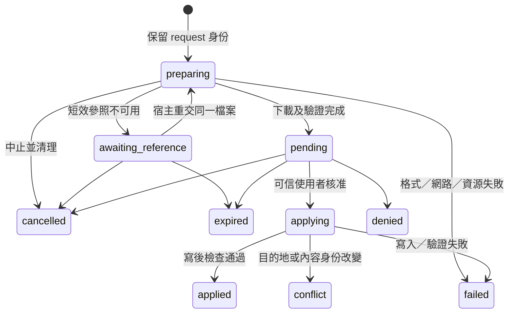

# ChatGPT 圖片匯入本機：架構與驗證設計稿

日期：2026-10-03。狀態：**規劃稿，尚未恢復公開 MCP 匯入工具，尚未通過真實 ChatGPT／Tunnel 端到端驗證**。

本稿依目前程式碼、[README](../../README.md)、[CONTRIBUTING](../../CONTRIBUTING.md)、[SECURITY](../../SECURITY.md)及[側欄決策邊界](../../.agents/skills/kairomes-sidebar-planning/references/boundaries.md)規劃。目標是讓使用者在 ChatGPT 指定一張圖片與本機專案目的地，經可信側欄審閱後建立本機圖片檔。這次只產出設計，沒有啟用工具、修改權限、執行真實帳號測試或搬移圖片。

## 1. 決策與功能範圍

採用**Kairomes 自己直接公開的 MCP 工具、頂層 `file` 輸入，以及工具 descriptor 的 `_meta["openai/fileParams"] = ["file"]`**。先以不落檔的實驗確認真實 ChatGPT 宿主能交付檔案，再接回既有下載、驗證、個別核准與建立新檔的骨架。

一期一次一張 PNG／JPEG／WebP，只建立掛載工作區內的新檔，父資料夾必須已存在。每筆匯入都需要可信 Extension 原生畫面的個別核准；現行檔案自主及全自主 grant 不代替匯入核准。圖片匯入一期不提供舊式本機核准頁 fallback，因該頁沒有原圖 hash／decode／審閱資格流程；既有其他操作的 fallback 保持原功能。模型不能掛載資料夾、開啟實驗開關、取得側欄憑證或自行核准。

**G0 真實宿主閘門未通過前，正式工具清單維持沒有 `artifact_import_*`。** 上傳圖片成功不代表 ChatGPT 原生生成圖片成功；若只通過上傳，最多能發布明確限定的「匯入已上傳圖片」，不能發布「自動保存 ChatGPT 產圖」。文件、其他 connector 成功回報、截圖與合成測試皆不能替代 G0。

不在一期範圍：任意 URL 下載、Base64 參數、shell 搬圖、讀取 ChatGPT DOM／Cookie、覆寫既有檔、多圖批次、SVG／GIF／PDF／PSD、跨聊天來源追蹤，以及產圖完成後無人確認的自動保存。使用者下載後選檔／拖入可另作可信本機輸入途徑，但它不證明 ChatGPT 的檔案參數契約可用。

## 2. 現況與差距

| 能力 | 狀態 | 現行依據與本稿處理 |
| --- | --- | --- |
| 工作區圖片預覽 | 已實作 | [`artifact_preview`](../../apps/daemon/src/tools.ts)只讀取已存在的工作區圖片；不能接收 ChatGPT 遠端圖片 |
| ChatGPT → 本機公開匯入 | 待驗證 | [`server.ts`](../../apps/daemon/src/server.ts)記載因真實 E2E 契約不相容而停用；[`artifact-import-http.test.ts`](../../apps/daemon/src/artifact-import-http.test.ts)驗證工具清單沒有匯入工具 |
| 頂層檔案 object | 已實作，內部 | [`ArtifactImportRequestSchema`](../../packages/protocol/src/artifact-import.ts)已有 `file`，包含四個公開契約欄位；沒有接入公開 `Inputs` |
| 直接工具的 `openai/fileParams` | 新增、待驗證 | 現行 [`server.ts`](../../apps/daemon/src/server.ts)沒有此工具 metadata；需檢查實際 `tools/list` 產物 |
| 受限遠端下載 | 已實作、待改善 | [`openai-file-download.ts`](../../apps/daemon/src/openai-file-download.ts)限制 HTTPS、delivery host、DNS、重新導向、20 秒及 25 MiB；來源證明與 DNS 連線綁定仍有限制 |
| 檔頭、尺寸與格式檢查 | 已實作、待改善 | [`artifacts.ts`](../../packages/workspace-core/src/artifacts.ts)解析 PNG／JPEG／WebP 與尺寸；不是完整解碼或惡意內容掃描 |
| 新檔寫入及寫後驗證 | 已實作 | [`WorkspaceArtifactImports`](../../packages/workspace-core/src/artifact-imports.ts)使用暫存檔、同步、create-only link、SHA-256 與寫後讀取檢查 |
| 記憶體等待及個別核准 | 已實作，內部 | [`ArtifactImportManager`](../../apps/daemon/src/artifact-imports.ts)先下載再建立 pending，保留 verified bytes；可信管理方法才可 apply |
| 下載前 request 身份與取消 | 新增 | 現行 request 在下載／prepare 完成後才放入 request map；需要先保留身份、可查 preparing 並中止網路 |
| 相同 request 的 URL 更新 | 已實作一部分、待改善 | 現行邏輯 hash 排除 URL，已下載的相同請求不重下載；尚需處理下載失敗、更新參照、晚回覆與取消競態 |
| pending 圖片的可信預覽 | 新增 | 現行核准詳情只有來源名、目的地、格式、尺寸及大小；現行 `/api/artifacts/content` 只讀取已落地檔案 |
| 核准結果不明的對帳 | 待改善 | 側欄已有決策鎖與狀態核對骨架；匯入需要原決策身份與明確收據，不可以仍為 pending 便判定未執行 |
| 重啟後收據／完整審計 | 尚未實作 | 現行匯入 jobs／requests 在記憶體；一期保留限制，不承諾跨實例 exactly-once |
| 聊天身份或來源歸屬 | 尚未實作 | 活動只關聯 workspace／tool／import；側欄專案篩選不能證明某個聊天擁有此操作 |

Git 可達歷史中的相關檔案從建倉提交 `dbef01f` 就已是停用版。殘留 schema 證明曾規劃頂層 `file`，但找不到帶 `openai/fileParams` 的公開註冊版本。因此既不能宣稱這個直接工具方案已驗證失敗，也不能宣稱加上 metadata 就一定成功。

## 3. 三種檔案傳遞層不能混同

### 3.1 公開宿主契約

[OpenAI Plugins Reference 的 Define file inputs](https://developers.openai.com/plugins/reference#define-file-inputs)規定：`openai/fileParams` 列出頂層檔案欄位；檔案 object 宣告 `download_url`、`file_id`、`mime_type`、`file_name`，前兩者必填，後兩者選填。工具輸出的 `structuredContent` 應有相符的 `outputSchema`。同頁 [File APIs](https://developers.openai.com/plugins/reference#file-apis)另提供選用的檔案選擇、上傳及取得暫時下載網址能力，須檢查宿主是否提供。

這份文件支持直接工具的 descriptor 設計，**沒有明確保證每一種 ChatGPT 原生產圖都能成為這類檔案輸入**。也沒有把 ChatGPT 執行環境路徑定義為本機 daemon 可讀的路徑。真正交付什麼，仍要經 G0 看實際 MCP 邊界。

### 3.2 generic downstream broker

[`mcp_tool_call`](../../packages/protocol/src/mcp-host.ts)的使用者參數放在 `arguments` 物件內。把下游工具描述中的 `file` 原封不動塞入 `arguments.file`，不等於 Kairomes 外層工具向宿主宣告了頂層檔案欄位。此路徑也不能假設下游的 `fileParams` 會被宿主遞迴解讀。

一期獨立使用 `artifact_import_request`，不在 generic broker 的任意 JSON arguments 上增添檔案重寫，也不開放下游 metadata 改變 Kairomes 外層權限。後續若要支援下游檔案輸入，需另立固定、明確的外層轉接契約。

### 3.3 本環境 Google Drive runtime 的路徑重寫

本次可取得的 connector 工具描述包含：`google_drive_upload_file.file_uri` 是字串且描述為 runtime／connector 的檔案參照與絕對本機路徑；`google_drive_batch_update_document.image_uris` 提及 runtime 目前只重寫頂層檔案參數。這是**該 connector 的工具描述證據**，沒有取得後端實作，也沒有在本次規劃執行上傳。

使用者提供的成功截圖可作為另一條宿主 runtime 可能已能搬檔的研究線索。其路徑型參數不能直接替換本稿的 object 型 `file`，也不能推導外接 Kairomes／Secure MCP Tunnel 具有相同的 path 重寫服務。不得把截圖的私人路徑、檔名、圖片或成功數字寫入測試 fixture 或公開紀錄。

若 G0 收到字串路徑，記為「實測契約不同」並停下 object 路線的啟用；不能在 daemon 嘗試讀取 `/mnt/data`，不能把字串當 URL，也不能自動放寬成 object／字串／Base64 混合輸入。只有取得適用於外接 MCP 的正式契約與新的受控測試，才能另建 adapter。

## 4. G0：先證明交付能力，完全不落檔

### 4.1 實驗工具與隔離

新增開發用 `artifact_import_probe`，只在可信本機管理面明確啟用的測試實例註冊，不加入正常發佈工具清單，不由 MCP 輸入或 downstream server 啟用。使用者可在測試 App／Tunnel 中重新整理工具後檢查 descriptor；實驗不要求讀取私人對話、產圖歷史、Cookie 或管理秘密。

probe 分兩步：G0a 只驗證收到的檔案欄位形狀，完全不做網路請求；G0b 對使用者指定的**公開或合成圖片**受限下載到記憶體，完整解碼並檢查格式、尺寸、大小與內容 hash，立即清理 bytes。G0b 必須先實作可綁定已驗證 IP、保持原 hostname TLS 驗證的 transport，以及有資源限制的完整 decoder，並在可信本機管理面一次性啟用；一次最多 5 MiB、4 × 1024 × 1024 像素、單 downloader／單 decoder worker、20 秒。不能先拿未 pinning 的現行 downloader 執行真實 bytes probe，再將結果宣稱為安全驗證。

probe 不呼叫 `WorkspaceArtifactImports.apply`，不建立 pending 核准、不寫暫存檔、不創建目的資料夾，也不保存圖片內容。若安全 transport／decoder 尚未完成，只能完成 G0a 並將 G0b 保留未測；來源契約 shape 成功不能替代 bytes 成功。

若 SDK 在 handler 前因 string／缺欄位拒絕輸入，probe handler 本身看不到原始形狀。開發實例可在 MCP `tools/call` 進入驗證前增加只計算「object／string、必要欄位存在、驗證結果」的暫時觀察鉤子；它不能保存或輸出原參數、放寬輸入 schema、為 string 增加另一條下載入口。如此才能區分「宿主未呼叫」「宿主交付了不同形狀」與「工具已收到但網路下載失敗」。

在合成測試中注入 downloader，可以檢查驗證及資源清理，但不能將注入的 URL／bytes 列為真實宿主證據。正式開關與 probe 開關分開；即使 probe 成功，也須由開發者根據完整 G0 結果調整產品 capability 與測試，不能由 probe 回傳值自行永久啟用工具。

### 4.2 什麼才算可信來源

「收到像 `file_id` 的字串」及「URL 位於 OpenAI 網域」只證明形狀與下載政策相符，**不能證明是宿主注入、不能證明使用者選了這張圖，也不能證明圖片由 ChatGPT 生成**。MCP 傳輸驗證的是可呼叫服務的通道；一般工具參數仍應視為不可信資料。現行公開契約沒有提供本稿可驗證的 signed file attestation。

G0 的來源證據須同時滿足：

1. 真實宿主的 `tools/list` 顯示直接工具、頂層 `file` 的完整四欄 object 與正確 `fileParams`，不是手造工具呼叫或 broker 包裝。
2. 使用者在受控聊天中選定可公開的生成圖片或上傳圖片，並明確要求將該圖片交給 probe；記錄來源類別及操作步驟，不保存聊天逐字稿。
3. 在 Kairomes 接收 MCP 呼叫的邊界觀察到宿主交付的 object，必要欄位存在；不得靠人工貼短效 URL、模型補造 URL 或本機檔案代替。
4. 從這個 object 取得的 bytes 通過下載與格式檢查，並與該合成來源原檔的尺寸、大小及 hash 相符。對生成圖片應比較原圖匯出的 bytes；若宿主交付的是轉碼版本，須能獨立確認視覺內容、記錄轉碼差異，不能假稱位元組相同。
5. 工具回覆成功，記憶體清理完成，本機沒有新增圖片或暫存檔；重試及新聊天再次測試能重現。

這是受控相容性證據，不是所有未來請求的密碼學來源證明。產品仍需 URL／網路檢查、內容驗證及逐筆本機核准；UI 來源文字使用「ChatGPT 交付的圖片」，除非有額外可靠來源資料，不能宣稱「已證明由 ChatGPT 生成」。

### 4.3 測試矩陣與通過條件

| 測項 | 真實材料／操作 | 可觀察的結果 | G0 意義 |
| --- | --- | --- | --- |
| 工具探索 | 相同 daemon 版本、真實 ChatGPT developer App、Secure MCP Tunnel | descriptor 完整；schema 掃描／探索通過；資料真正到 daemon | 必要，InMemoryTransport 成功不能代替 |
| 新生成圖片 | 當輪生成一張公開合成圖後指定 probe | object 交付與 bytes 驗證成功 | 「保存產圖」必要 |
| 生成後修改 | 編輯同一張合成圖後指定修改版 | bytes／內容對應新版而不是舊圖／縮圖 | 獨立能力閘門；通過才宣稱支援修改版匯入，一期可明確排除 |
| 較早生成的圖片 | 明確指定較早回合的合成原圖 | 交付指定版本，不猜測來源或替換成當輪圖 | 獨立能力閘門；通過才宣稱支援舊圖匯入，一期可明確排除 |
| 上傳圖片 | 手動上傳已知 hash 的 PNG／JPEG／WebP | 同類 object 與原始 bytes 相符 | 區分上傳與生成能力 |
| 多圖選一 | 同聊天生成或上傳兩張可識別合成圖，指定其中一張 | 只交付指定的一張，無猜測來源 | 獨立能力閘門；通過才支援多圖情境的選圖，一期可要求單圖情境 |
| 非相容參照 | 宿主若交付 string、raw ID、sandbox path 或缺欄位 | 分類為不支援，無網路、無檔案寫入 | 契約失敗須可辨認 |
| URL 到期／刷新 | 控制延遲或宿主重新交付同一檔案 | 分類到期；新 object 可重試下載；不改成任意 URL | 確認暫時 URL 行為 |
| 可選檔案 helper | 宿主有／無 `selectFiles`、`uploadFile` 等能力 | 有能力才提供選檔；無能力清楚隱藏 | 選用研究，不能作產圖必經步驟 |
| 新聊天與重接 | 新聊天、工具重新整理、Tunnel 重連 | 相同 descriptor；不沿用舊來源或舊授權 | 檢查可重現性及範圍 |
| Chrome／Edge | 先在主要瀏覽器完成，再補另一個 | 區分宿主傳檔與原生側欄驗證結果 | 宣稱支援哪個瀏覽器需對應證據 |

矩陣記錄版本、日期、OS／瀏覽器、App／Tunnel 路徑類別、工具 descriptor 版本、來源類型與成功／失敗分類。不記錄帳號、Tunnel ID、檔案 ID、短效 URL、聊天內容或圖片。「當輪新生成圖片」至少以三次獨立生成、獨立請求重現成功，已知 hash 的上傳圖片也是核心對照；一次偶然成功不能作正式發佈閘門。修改版、舊圖與多圖選一各自按發佈範圍記錄能力閘門，不強制一期全部支援，也不能由新圖通過外推。若目前宿主不能選取生成圖片，保留未通過，不用其他 connector 或 API 產圖代替。

G0 通過只允許進入受控本機匯入階段。公開功能還需 G1 的下載與核心失敗案例、G2 的可信審閱／核准及回覆遺失、G3 的完整真實宿主落檔驗收全部通過。

## 5. 公開工具及 schema 草案

以下是**新增設計**，不是現在可呼叫的工具。採 request／poll／cancel 命名以符合現行一次性命令及檔案變更習慣。一期不提供模型的 approve／commit／access 工具。

| 工具 | 輸入 | 輸出／作用 | annotations 草案 |
| --- | --- | --- | --- |
| `artifact_import_request` | `expected_instance_id` UUID、`workspace_id` UUID、`request_id` UUID、相對 `path`、短 `summary`、頂層 `file` | 先核對實例並保留 request 身份，再下載準備，回傳 `artifact_import` 與 `instance_id`；不自行落檔 | readOnly=false、destructive=false、openWorld=true、idempotent=true；同實例的有界去重 |
| `artifact_import_poll` | 必填原 `instance_id`，再加嚴格 union：`request_id` 或 `import_id` | 唯讀查詢 preparing／pending／終態及相同 request 是否已接受；不觸發重下載或寫入 | readOnly=true、destructive=false、openWorld=false、idempotent=true |
| `artifact_import_cancel` | 原 `import_id`、`instance_id` | preparing 中斷下載；pending 清理 bytes；applying 只回當前狀態；不承諾復原已寫入檔 | readOnly=false、destructive=false、openWorld=false、idempotent=true；同 ID 重複取消不重做 |

request 的檔案 schema 必須保持以下形狀。這是自有工具的 descriptor 草圖；實作須測試 Zod → JSON Schema 後的真正 `tools/list`，不能只檢查 TypeScript 宣告。

```json
{
  "name": "artifact_import_request",
  "inputSchema": {
    "type": "object",
    "properties": {
      "expected_instance_id": { "type": "string", "format": "uuid" },
      "workspace_id": { "type": "string", "format": "uuid" },
      "request_id": { "type": "string", "format": "uuid" },
      "path": { "type": "string", "minLength": 1, "maxLength": 1024 },
      "summary": { "type": "string", "minLength": 1, "maxLength": 200 },
      "file": {
        "type": "object",
        "properties": {
          "download_url": { "type": "string", "minLength": 1, "maxLength": 4096 },
          "file_id": { "type": "string", "minLength": 1, "maxLength": 512 },
          "mime_type": { "type": "string", "maxLength": 200 },
          "file_name": { "type": "string", "maxLength": 255 }
        },
        "required": ["download_url", "file_id"],
        "additionalProperties": false
      }
    },
    "required": ["expected_instance_id", "workspace_id", "request_id", "path", "summary", "file"],
    "additionalProperties": false
  },
  "_meta": { "openai/fileParams": ["file"] }
}
```

`file` 不改為 string、nullable、generic JSON 或 Base64。路徑雖在 descriptor 是 string，仍由 daemon 使用共用 `validateRelativePath` 驗證。`mime_type`／`file_name` 缺省是合法宿主輸入；不能因選填資料不齊便要求模型補造。名稱只用於顯示，不參與目的路徑計算。

新增 `kairomes_status.instance_id` 及匯入 capability 摘要，讓模型在 request 前取得本次實例，再將該值送入必填 `expected_instance_id`。instance 不符時在任何 request 保留、下載或副作用前拒絕。若第一次 request 的回覆遺失，使用原 `(expected_instance_id, request_id)` poll；不能重新讀 status 後把舊請求轉綁到新實例。尚不知道原 instance 時，只能讀取 status 的「目前實例摘要」，把舊操作保留 unknown；這不是原操作的對帳結果，也不能解除舊鎖。若取消時還不知道 import_id，先以原 instance／request_id poll 取得身份，再取消，不新增按不完整來源猜測的 cancel 入口。

新增 `ArtifactImportPublicSchema` 與 `ArtifactImportResultSchema`，在 [`ToolData`](../../packages/protocol/src/index.ts)、`ToolService.execute`／`call` 及 output validation 同步接入。公開 view 僅包含 `id`、`request_id`、`workspace_id`、相對 `path`、安全摘要、`state`、`write_outcome`、時間、經驗證的格式／尺寸／大小／版本及成功後的 `artifact`；未取得 bytes 時相應欄位為 null。結果另帶 `instance_id`，用來拒絕舊實例引用。

`write_outcome` 是必填 enum：`not_written | written_verified | unknown`。`not_written` 必須有依據確認目的檔沒有由本次操作建立；`written_verified` 表示本次原 bytes 已落檔並通過寫後驗證，只有此 outcome 可搭配 `applied`。寫入開始後尚未確認、寫後驗證失敗或清理結果無法確認時使用 `unknown`。`failed + unknown` 保留結果不明鎖，只允許查詢／對帳；它不能被一般終態 UI、MCP description 或 retry 分支解讀為「安全重試」。

正常 `applying + unknown` 且原操作 processing 收據可確認時，介面維持「寫入中」，仍禁止重送；這個 outcome 表示寫後結果尚未完成。只有提交／processing 收據無法確認，或終態仍為 unknown，才投影成「結果待確認」。不能讓 outcome 的 unknown 無條件蓋掉權威進行中狀態。

對模型／widget 隱藏 `download_url`、原始 `file_id`、完整來源檔名及 fingerprint。`ArtifactImportApproval` 另為可信 panel view，包含核准 fingerprint、專案顯示名與經清理的來源名稱；內部 job 可短暫持有原參照。既有 `ArtifactImportResult` 直接複製內部 view 的方式需改成明確 DTO，不能以省略單一 URL 欄位代替資訊分類。

annotations 不提供任何授權，只有 daemon 的路徑與可信核准 gate 能允許寫入。request 會建立本機待辦與後續寫入流程，因此不能標為 readOnly。現有 allowlist 仍以遠端 URL 取檔，保守標 openWorld；若後續有更明確的封閉檔案服務契約，再重新檢查此標記。`idempotentHint=true` 僅描述同一 instance、保留的 request 身份與相同邏輯輸入下不產生額外操作；容量耗盡在接受前拒絕，跨重啟／收據遺失不承諾去重，未知結果也不能換新 ID 自動重跑。

MCP description 使用英文，至少明示：宿主檔案參數才是來源；只建立新檔；需要本機個別核准；request acceptance 不是落檔成功；先 poll 原 ID；不要索取短效 URL、tokens 或 fingerprints。invoking／invoked 文字為「正在準備匯入…」／「匯入請求已建立」，只有 `applied` 才顯示「已儲存到本機」。

### 5.1 傳輸大小與回應時間

現行 [`relay.ts`](../../apps/cli/src/relay.ts)每筆 JSON-RPC 輸入上限 32 KiB、HTTP 回應等待 30 秒；[`preview.ts`](../../apps/daemon/src/preview.ts)的 HTTP body 上限是 320 KiB。檔案 object 只傳短參照，不把 25 MiB 圖片塞進 JSON、Base64 或 body，也不因圖片功能而放大通用 relay 上限。schema 各欄最大值組合仍須加入序列化大小測試；回覆也保持 bounded metadata。

20 秒的遠端下載加上 descriptor／Tunnel／解析／prepare 不一定能在 30 秒完成。request 須先建立可查詢的 preparing 身份並快速返回，再在 daemon 有生命週期管理的 job 執行下載；不能只在 HTTP handler 起一個未追蹤 Promise。poll 回覆不等待下載結束；服務關閉會等待／取消 job。`preparing` 是正常狀態，回覆遺失仍可按 request_id 查詢。G0 shape probe與 G0 bytes probe分開，後者即使是唯讀仍須有可查的 bounded job 或符合實測時間預算，不能把30秒逾時當成宿主不支援。

## 6. 狀態、去重與結果不明

### 6.1 建議狀態機



`preparing`、`awaiting_reference` 是新增；既有 pending／applying／終態可沿用。request 身份須在下載之前保留，確保回覆遺失後能按 `request_id` 查到在途工作。等待短效參照與等待核准各最多五分鐘，preparing 有獨立下載逾時；不得以刷新參照無限延長工作。取消要使用 AbortController、generation／cancelled flag；晚到的 bytes 不得建立 pending。

### 6.2 去重與 URL 刷新

| 情境 | 規則 |
| --- | --- |
| 同 request，URL 相同或更新，verified bytes 已在 pending | 回同一 import，不重下載、不換 fingerprint，不延長核准期限 |
| 同 request，第一次 preparing 在途 | 返回同一 preparing；不開第二個 downloader，不讓後來的 URL 擅自替換在途工作 |
| 同 request，短效 URL 已確認無效，尚無 verified bytes | 保留 ID 與原邏輯輸入；進入 awaiting_reference；只接受宿主重新交付同 file_id 的完整 object，最多兩次刷新 |
| 同 request，workspace／path／summary／file_id 改變 | `ARTIFACT_IMPORT_REQUEST_CONFLICT`；沒有任何新下載或寫入 |
| optional file name／MIME 在刷新時缺省或改變 | 視為顯示／宣告 metadata，不能重建邏輯工作；以 verified MIME 與最初安全顯示資料為準；不一致時拒絕或要求新審閱 |
| 已核准或 applied 後刷新 URL | 返回原結果，不改內容、不重寫 |
| 同 ID 已 denied／cancelled／expired，或 failed 且 not_written | 返回原已確認終態；只有 awaiting_reference 的受限刷新有例外；新需求由使用者明確提出後才用新 ID |
| failed 且 write_outcome=unknown | 返回原結果不明狀態，保留查詢／對帳鎖；不能因 failed 字樣而刷新內容、改名或建立新 ID 重試 |
| 發現新的 bytes 與已保留內容 hash 不同 | 原核准失效，拒絕變更；一期不替換 pending bytes，不沿用 fingerprint |

穩定身份使用 workspace、相對 path、summary 及 file_id，排除短效 URL；內容取得後再綁定實際 SHA-256。可選的宿主 metadata 不能讓相同邏輯請求產生第二筆落檔。這是一期對現行 `stableInput` 的調整提案，必須用測試確認，不能直接改 hash 定義卻省略對帳行為。

401／403／404 不一定全部表示 URL 到期。downloader 應回固定、安全的原因分類，例如 `reference_unavailable`；只有有足夠證據才顯示「已過期」，不能回傳遠端 body 或 URL。daemon 不持有 ChatGPT Cookie／OAuth，不用自己的 API key 解決來源權限，不向模型索取 URL。刷新來源仍交給宿主；若宿主未提供重新交付能力，結束工作並要求使用者重選圖片。

### 6.3 request／核准回覆遺失

MCP request 超時不代表未接受。先用同一 request_id 查詢；尚無回覆或同實例查不到時顯示「結果不明」，不能換 UUID 重建匯入。request map 及 retention 需保留已接受的身份，容量不足時在接受前拒絕。poll 不重新執行 request。

側欄的批准回覆遺失後，保留原 import_id、fingerprint、action、instance 與配對來源的決策鎖。查到同一件 `applied + written_verified`，或明確未寫入的拒絕／取消／到期等結果才能對應解除；`failed + unknown` 保留鎖，只看到仍 pending 或一般 SSE 更新不能認定批准沒執行。建議在可信 `/api/panel/approvals` 管理通道增加有容量與期限的**決策收據查詢**，依原 identity 對帳；收據、fingerprint 不出現在 MCP／iframe。

原生核准請求新增 `approval_request_id` UUID。stable identity 至少綁定 `(instance_id, import_id, request_id, action, fingerprint, verified_content_hash, pairing_owner)`；配對 owner 由已驗證 panel token 在服務端解析，不接受客戶端自稱 owner。相同 approval_request_id、相同完整身份只查原收據，不再次批准；同 ID 不同身份回 conflict。先保留有界的決策收據名額，再發生批准／拒絕副作用，滿容量須先拒絕。可信查詢可依原 approval_request_id 讀 processing／已確認結果，但 missing、收據過期、身份不符、其他 instance、`failed + unknown` 都不能解除原結果不明鎖。核准項目本身到期且明確未寫入，與「收據已過期因此不知道決策結果」是不同情況。

核准內容更新、來源 bytes 變更或目的地變更均須重新審閱。不能自動在內容更新後重送舊 fingerprint，不能讓返回佇列或關閉詳情清除未知決策鎖。

### 6.4 取消、解除掛載與重啟

preparing／awaiting_reference／pending 可取消，清理 bytes 並阻止晚回覆恢復。進入 applying 後，cancel 只回傳 applying 或實際終態；若檔案已建立，不能說「已取消」或自動刪除。解除掛載及關閉服務須中止在途下載、取消未核准工作，再等待受控 applying 結束並回收 buffer。

一期沿用記憶體收據，不承諾跨重啟去重。instance 改變時，舊 poll／cancel 必須回 `INSTANCE_CHANGED`／unknown，不把原 UUID 當成新請求。若原執行可能已寫入，使用者可重新檢查目的地與已知 hash；同檔 hash 相符只能證明目前內容，不證明原請求恰好執行一次。檔案已存在仍拒絕覆寫，不能因結果不明而自動改名存第二份。

若產品要承諾「重啟後仍可自動恢復結果」，需另作私人本機的持久收據設計：寫入前保留操作身份、寫入後原子記錄結果、處理 crash 中間態與 workspace 重掛載身份；只存必要 metadata，不存短效 URL、token 或圖片 bytes。本稿不把它列作一期已有能力，也不將記憶體活動視為完整審計。

## 7. 下載、格式及本機寫入邊界

### 7.1 下載與 SSRF

沿用 HTTPS、禁止 credentials／fragment／非 443 port、拒絕 sandbox／file／本機路徑、每次 redirect 重新驗證、最多兩次 redirect、20 秒與串流實際 bytes 上限。Content-Length 只是提早拒絕依據，缺省、錯誤值、chunked 及壓縮回應都以實際可用 bytes 上限為準。顯示的 MIME 由 bytes 決定，不信 URL 後綴或 HTTP Content-Type。

**待改善：**現行允許多個 OpenAI root domain 的全部子網域；G0 應分類實際 delivery host，再整理最小必要的交付政策，不因一次失敗就接受任意 HTTPS。`chatgpt.com` 可下載 endpoint 不代表 daemon 有該帳號 Cookie；沒有驗證資料不能聲稱可下載。下游 MCP、模型及 iframe 都無權添加 allowlist。

**待改善：**現行先 `dnsLookup` 驗證、後由 `fetch` 自行解析，未把已驗證地址綁到實際連線；存在 DNS rebinding／解析競態。IPv4／IPv6 非全球可路由位址分類也需完整測試，不能只靠部分正則與幾個範例宣稱 SSRF 已完全消除。進入公開 G1 前應選定可綁定已驗證地址並保留 TLS SNI／憑證驗證的受控 transport，對每次 redirect 重做。候選方案是 `node:https` 的受控 `lookup` 僅返回已驗證位址，同時保持原 hostname 的 SNI、Host 與預設 TLS 驗證；這是待實作、待跨 OS 驗證的設計，不表示現行 downloader 已有 pinning。若 runtime 不能支持，保留 blocker 或有充分依據的受限部署設計，不能默默跳過。

不轉送瀏覽器 cookies、Authorization、Referer、使用者自訂 headers 或本機環境憑證。URL 只存於在途下載閉包，成功／失敗即釋放；遠端錯誤 body 不出現在 stdout、tool output、活動或診斷。

### 7.2 大小與解碼

現行上限是 25 MiB，單邊不超過 16,384，像素總數不超過 80 × 1024 × 1024；副檔名須與 PNG／JPEG／WebP 實際格式一致。格式 parser 只做結構與尺寸判斷，不能宣稱完整解碼、安全掃描或移除 EXIF／metadata。

**新增一期匯入預算提案：**先將匯入解碼限為 16 × 1024 × 1024 像素、daemon decode concurrency=1、Extension pending preview concurrency=1；每張完整 RGBA 約 64 MiB，仍另預留 codec、壓縮 bytes、hash 所需 buffer、Blob 與畫面解碼的記憶體。以獨立 decoder worker 的硬上限、逾時及整個 importer 的總預算把關；Extension 的單件預覽也須測量峰值，包含先 hash 再解碼的暫時拷貝及前一張撤銷後的回收延遲。具體總預算需用 Windows 11 的 Chrome／Edge 實測設定；達成單件 decode 預算才可升為一期，若超限就收緊像素而不是容許無界解碼。這是新增限制，不能寫成現行已是 16 MP。工作區既有圖片預覽的 80 MP 政策需另評估，不能讓這次匯入測試替它背書。

G1 應選定有完整 decode 與錯誤分類的成熟 codec，對 PNG／JPEG／WebP 驗證可解碼，並測試截斷、錯誤 chunk／marker、trailing data、動畫與畸形 metadata。合法 EXIF／ICC／XMP 等格式內 metadata 保留；不接受容器結束後附加不相關 payload，須依格式定義而不是只看最後幾個 bytes。完整解碼仍不是保證圖片無漏洞或惡意內容，decoder 需維護與資源限制。

**一期採 A 原圖方案：**保持來源 bytes，不自動轉碼、改格式或清掉 metadata；pending-content 傳回完整 verified 原 bytes。Extension 自行計算 SHA-256，與已審閱版本相符後，使用同一份 bytes 建立 Blob、解碼並等比例展示。畫面可縮放原圖尺寸，但不產生或傳遞另一個縮圖檔，避免把縮圖 hash 與原圖 fingerprint 混同。核准及落檔都綁定原圖 bytes 的 hash。明確決定是否支援動畫 PNG／WebP：本稿建議一期拒絕動畫容器，加入 parser 偵測及失敗測試；現行碼沒有這項完整保證。SVG 不進入 decoder，也不能另存為 HTML 或 data URL。

圖片公開回傳給模型沿用現行較小的圖片回應界限；不要把完整 25 MiB 編成文字。超過模型圖片回應界限仍可由可信本機查看，MCP 只回相符 metadata。現行 80 MP 原圖若解為 RGBA，每張約 320 MiB；兩張 active、雙 buffer、串流 chunks／concat／prepare 複製及瀏覽器解碼可再增加峰值。25 MiB 傳輸限制不能作低記憶體保證。保留單份 verified 原 bytes，限制輸出拷貝及 decoder worker，按總 memory-budget gate 接受工作。pending 原圖預覽須先確認符合一期 16 MP 與單件瀏覽器解碼預算，不能以 CSS 限寬取代像素／記憶體限制。

現行 manager 是 active=2、retained=24、request 身份最多 4096、pending 五分鐘；這些需在新增 preparing／awaiting_reference 及 decode queue 後重新定義：一期 active=2 計入全部未完成邏輯工作；awaiting_reference 不占 decoder，但仍占 active 名額。下載及解碼另有並行數與 bytes 預算。retained 到期釋放內容，但 request tombstone 仍阻止同 ID 重跑。數量達上限時拒絕新工作，不能踢掉未完成工作或刪掉未知結果的唯一身份。

### 7.3 路徑、TOCTOU 與寫後失敗

沿用 [`paths.ts`](../../packages/workspace-core/src/paths.ts)：工作區 opaque ID、相對路徑與 `/` 分隔，不接受絕對路徑、`..`、反斜線、ADS、控制字元、保留名稱、私人目錄、symlink／junction。重新檢查掛載 root 的身份、父資料夾 realpath、目的地尚不存在與內容 hash，再寫暫存檔、sync、create-only link、刪暫存及重新 inspect。

這是以主機權限執行的檔案操作，純 TypeScript 的驗證不能完全消除其他本機可寫程序製造的 TOCTOU；沿用 [SECURITY 的限制](../../SECURITY.md)。測試至少包含審閱期間目的地出現、父路徑被替換成連結、root 被替換、unlink／link／sync 失敗及寫後讀取版本改變。不能把 create-only 宣稱為工作區 OS sandbox。

暫存清理需涵蓋**從 `open`、write、sync 到 link 的全部失敗區間**；目前核心在寫入暫存 handle 的階段發生錯誤時，可能尚未進入後面的 unlink finally，須補測與整理 cleanup scope。rollback 只刪除仍匹配自己建立 identity 的檔案；若其他程序已替換，不刪使用者內容。

若寫後驗證／清理失敗，回應須保留實際不確定性，例如 `failed` 且 `write_outcome = "unknown"`，鎖定為只能查詢／對帳，讓使用者檢查目標；不能一律聲稱未寫入，也不能被終態 retry 邏輯自動換 ID 重試。`applied` 必須搭配 `written_verified`，只代表那次 bytes 已寫入並驗證，後續外部程式仍可能改動；重新 preview 必須檢查版本。cancel 在寫入開始後只回目前進度與 outcome，不復原、不將 unknown 改成 not_written。

## 8. UI 與可信核准分工

| Surface | 允許能力 | 必須維持的邊界 |
| --- | --- | --- |
| ChatGPT MCP result | 呈現 request 狀態；applied 後顯示 metadata／圖片成果 | 不提供本機批准、管理權杖、待核准 private preview URL；工具完成文案不等於落檔成功 |
| localhost 工作台 iframe | 閱讀本機活動及 applied 成果 | 不批准；不以 iframe 訊息或內嵌按鈕代送批准 |
| Extension 原生核准詳情 | 顯示待存圖片、專案、相對目的地、格式／尺寸／大小、期限及「匯入圖片」 | 要以原 fingerprint 審閱並決策；離線／過期／內容改變／結果不明時停用；專案篩選不改授權 |
| 獨立本機核准頁 | 一期不提供圖片匯入核准；其他既有種類維持原功能 | 舊頁沒有原圖 hash／decode／審閱 gate；其 `/api/approvals` 匯入批准分支在一期須拒絕，不能以管理 token 跳過原生審閱 |
| Desktop／CLI | 掛載、開發實驗配置、Host 生命週期 | 不把管理面能力暴露給 MCP |

一期核准詳情應能看見**將要寫入的 verified 原 bytes 的圖片**，不能只憑來源檔名判斷取對圖。新增可信 panel 專用 pending-content route，以 POST、精確 Extension Origin、panel bearer、import_id 與已審閱 fingerprint 取得完整原 bytes；不要讓 panel token 出現在 URL。可使用 [`preview.ts`](../../apps/daemon/src/preview.ts)的既有 panel 授權骨架，不能擴充 `/api/artifacts/content` 使一般 iframe 取得 pending 資料。

沒有已配對且可用的 Extension 時，圖片匯入停在等待／到期，提供返回原生側欄的說明；不開舊式 fallback 代批准。daemon 不用「已有人按 legacy approve」繞過原生 hash／decode gate，也不把 pending 下載權限交給 admin／iframe。

只在仍 pending、來源／掛載／fingerprint 相符時供應 preview；回應不得帶 download URL。Extension 先對完整原 bytes 做 SHA-256 核對，再由同一份 bytes 建立受控 Blob URL、等待解碼成功後等比例展示；hash 不符、decode 失敗或單件記憶體預算未通過時不可核准。切換、返回、斷線、到期及解除配對時取消在途讀取、清除 bytes／解碼資格並 revoke Blob URL，世代失效的晚回覆不能恢復資格；同時只保留一張 pending 原圖預覽。CSP 最小開放 `img-src blob:`，不讓任意遠端頁面借用此 route。預覽失敗不自動核准，保留拒絕與重新讀取。

使用者的主畫面保持短佇列及單件詳情。pending 文案「等待你確認儲存位置與圖片」；applying「正在儲存」；applied「已儲存到本機」並提供重新預覽／本機查看入口；結果不明保留查詢動作，不能假顯示成功。逾時、取消或拒絕說明清楚且不搶歷史閱讀畫面。

沿用 [`approval-panel.ts`](../../apps/extension/src/approval-panel.ts)、[`approval-state.ts`](../../apps/extension/src/approval-state.ts)與 [`sidepanel.ts`](../../apps/extension/src/sidepanel.ts)的原生決策、閱讀鎖定、焦點與未知鎖。360／400／480px、200% zoom、鍵盤返回及狀態宣告都需要驗收；合成畫面只能證明布局與互動，不證明取得圖片、原生配對或真實核准。

grant 不接入本次 import manager。檔案自主目前指結構化文字變更；全自主也不代表使用者預先同意下載任意圖片或保存產圖。未來若要加入匯入自主，需明確增添可撤銷的類別、大小／目標規則、來源限制與跨聊天範圍說明，不能在舊 grant 下悄悄放行。

## 9. 敏感資訊與可觀測性

公開 diagnostics 與測試報告只記固定分類及統計：descriptor contract 版本、來源類型、state、error_code、bytes／尺寸區間、耗時、active count、cleanup 結果。request／import 可用報告內另生成的短 label 關聯；真實 ID、檔名、workspace path、URL 或圖片 hash 不寫入公開 fixture、screenshots、commit、issue 或聊天回報。

probe 只有公開合成材料可記精確 hash 與尺寸以比較內容；真實使用者材料維持本機，不因除錯上傳。狀態與審閱 metadata 只在必要的已驗證介面傳遞；模型可見相對目的地與結果，可信 panel 才看安全來源名稱及 fingerprint。短效 URL 不保留到 job、SSE、收據、result、local storage 或錯誤 message。

服務記憶體仍不是秘密隔離，也不是持久完整審計。只有 JSON-RPC 進 stdio stdout，診斷到 stderr 且同樣需去除敏感資訊；不能以「stderr」作為允許寫原 URL／逐字稿的理由。

## 10. 實作階段、檔案與驗收

| 階段 | 狀態／優先序 | 主要檔案與依賴 | 完成條件 |
| --- | --- | --- | --- |
| G0a descriptor／shape probe | 新增、P0 | [`server.ts`](../../apps/daemon/src/server.ts)、[`tools.ts`](../../apps/daemon/src/tools.ts)、[`artifact-import.ts`](../../packages/protocol/src/artifact-import.ts)；新增開發專用 probe 與 descriptor 測試 | 正常實例仍無 import／probe；測試實例的真實 tools/list metadata、頂層 schema 與回傳 shape 可驗證 |
| G0b 安全前置原型 | 新增、P0，先於真實網路 probe | pinned-IP transport、完整 decoder 與小預算測試；不接入 apply | 私人／保留位址、redirect、DNS 競態、TLS／SNI、格式／decode／cleanup 失敗案例通過；5 MiB／4 MP／單 worker 一次性 probe gate |
| G0b 真實記憶體取檔 | 待驗證、P0，依賴安全前置原型 | probe、受控 downloader／decoder、真實 ChatGPT／Secure MCP Tunnel | 當輪新圖三次獨立成功及上傳核心對照；修改、舊圖、多圖選一各自記錄能力閘門；無落檔；只留公開合成證據 |
| G1 下載／核心收斂 | 待改善、P0 | downloader／網路 transport、[`artifacts.ts`](../../packages/workspace-core/src/artifacts.ts)、[`artifact-imports.ts`](../../packages/workspace-core/src/artifact-imports.ts)及對應 tests | DNS 連線綁定、位址分類、redirect、資源限制、格式／動畫政策、全階段 cleanup、create-only／race 失敗案例通過 |
| G1 request／result schema | 新增、P0 | [`index.ts`](../../packages/protocol/src/index.ts)、[`artifact-import.ts`](../../packages/protocol/src/artifact-import.ts)、[`activity.ts`](../../packages/protocol/src/activity.ts)、[`tools.ts`](../../apps/daemon/src/tools.ts)、[`artifact-imports.ts`](../../apps/daemon/src/artifact-imports.ts) | status／expected instance、preparing 身份、public／panel DTO／write_outcome、必填原 instance 的 poll、cancel／refresh 對帳、正確 outputSchema |
| G2 可信預覽／決策 | 新增及待改善、P0 | [`preview.ts`](../../apps/daemon/src/preview.ts)、Extension approval／sidepanel、決策收據、對應 HTTP／UI tests | A 原圖完整 bytes→本機 hash→同份 bytes decode／展示、16 MP 單 preview 峰值驗收、exact Origin／token／fingerprint gate、錯誤 surface 禁止核准、failed+unknown 鎖、窄版與鍵盤驗收 |
| G3 受控完整落檔 | 待驗證、P0 | 相同 build 的 Desktop／Extension／daemon／Tunnel；已掛載合成工作區 | 真實生成圖→request→原生審閱→核准→建立新檔→版本核對，拒絕／衝突／重接也成立 |
| 正式工具與公開文件 | 新增、P1，依賴 G0–G3 | server 註冊、README、SECURITY、CONTRIBUTING、[現況表](kairomes-current-state.md)與開發計畫 | 只宣稱已通過的來源／瀏覽器／OS；保留已知限制；工具刷新與使用方式可重現 |
| 持久收據與匯入自主 | 選用後續，P2 | 需另立儲存／授權設計 | 一期不承諾跨重啟 exactly-once 或自動保存 |

MCP result 若加入新的匯入狀態，要檢查 [`mcp-result.ts`](../../apps/widget/src/mcp-result.ts)與其模型；如 resource 契約不相容，更新 `MCP_RESULT_URI`。工作台契約有不相容變更才更新 `WIDGET_URI`，不能把一般樣式更新當作任意更版理由。

### 必須通過的失敗案例

| 類型 | 驗收要求 |
| --- | --- |
| 契約 | 欄位缺失、optional 欄位誤必填、頂層 string／巢狀 broker、未宣告 fileParams、錯誤 outputSchema、普通發佈意外開 probe 都失敗關閉 |
| 來源 | raw ID／sandbox path／明確非法或不符合 delivery 政策的 URL 不下載；合法形狀與網域仍不能證明宿主注入，保留受控來源證據及個別看圖核准；uploaded 成功不能替代 generated 成功；修改、舊圖及多圖選一依發布範圍各自驗證 |
| 網路 | 非 HTTPS、URL credential、惡意相似網域、私人／保留 IPv4／IPv6、DNS 變動、redirect 跳私人位址／超次數、超時、空 body、缺 Content-Length／實際超限均有明確分類與清理 |
| 格式與資源 | spoofed MIME／副檔名、截斷容器、零尺寸／像素超限、動畫政策、超 active／總 memory／retention 上限；失敗不產生可批准內容 |
| 核准 | MCP／UI／admin 不能冒充 panel；舊式 `/api/approvals` 不批准圖片匯入；錯 Origin／token／fingerprint／過期／來源內容變動失敗；即使 files／full grant 有效仍 pending；原圖 hash／decode／單件預算全部符合才有審閱資格 |
| 去重／未知 | 同 ID 的 URL 刷新不重下載 pending；並行 request 一筆；preparing 回覆遺失可按原 expected instance／request 查；必填原 instance；批准回覆遺失保留鎖；同 approval_request_id 異身份拒絕、相同身份不重做；收據 missing／過期或 failed+unknown 不解鎖；舊實例不重跑；容量耗盡先拒絕 |
| 取消／race | preparing cancel 及解除掛載中斷 downloader，晚 bytes 不復活；pending bytes 清理；applying 不假稱取消；目的地競態不得覆寫 |
| 本機寫入 | symlink／junction／ADS／private path／root 改變拒絕；write／sync／link／unlink／verify 失敗全程清理；不得刪除已被替換的使用者檔案 |
| 顯示／隱私 | 模型／iframe／一般 SSE 不出現 URL、source file ID、fingerprint／panel token；公開證據只用合成材料；成功文案只跟 applied |

產品碼實作後依專案指引執行 `bun run check`；涉及 Desktop／Tauri／sidecar 再執行 `bun run desktop:check`。真實 G0／G3 必須另留經清理的相容性紀錄，不能把單元、HTTP fixture、InMemoryTransport 或 preview 通過寫成帳號端到端通過。

## 11. 本稿的證據邊界與待決事項

現在能確定：本機建立圖片檔的核心骨架已存在；公開 MCP 匯入已停用；公開文件支持頂層 object 與 `fileParams` 的直接工具設計。現在不能確定：原生生成／修改圖是否能在這個 ChatGPT App＋Secure MCP Tunnel 路徑交付，Drive runtime 的 path 重寫是否適用外接 MCP，及過去停用實驗當時實際發出的 descriptor。

進入產品碼之前先做 G0。G0 若不通過，停止直接匯入功能的公開啟用，保存精簡的失敗分類與 descriptor 版本，並回到可獨立成立的本機選檔／拖入設計；不放寬 URL、寫入權限或來源辨識來包裝成功。

官方參考：[OpenAI Plugins Reference](https://developers.openai.com/plugins/reference)、[Secure MCP Tunnel 指南](https://developers.openai.com/api/docs/guides/secure-mcp-tunnels)。公開文件與工具描述是契約依據，真實帳號測試才是相容性證據；本稿截至 2026-10-03 未執行後者。
