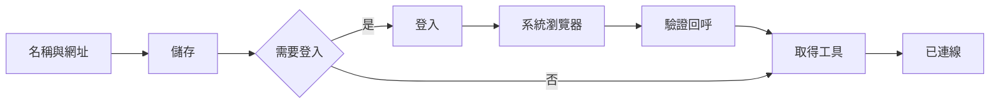

# MCP OAuth 登入支援開發規格

日期：2026-10-03。狀態：**第一階段原始碼與合成驗證已完成；Layer 真實帳號／原生側欄待驗，尚未發布。** 本規格接續 [MCP 連線修補](mcp-connection-recovery.md)，目標是讓使用者直接加入需要登入的遠端 MCP，完成登入後能在 Kairomes／ChatGPT 使用其工具。初次實作見 [實作紀錄](mcp-oauth-implementation.md)，最新檢查與限制見 [Layer 相容性修補](mcp-oauth-recovery.md)。

## 1. 交付目標與範圍

第一個相容性目標為 Layer。預期操作：填名稱與遠端 MCP 網址 → 儲存 → 在卡片按「登入」→ 到系統瀏覽器登入 → 回到 Kairomes，工具自動列出。Layer 的公開端點為 `https://mcp.app.layer.ai/mcp`；其官方文件確認使用 Streamable HTTP 與首次 OAuth 登入。[Layer 設定文件](https://layer.ai/docs/mcp/setup)

採用通用的 HTTP OAuth 實作，先用 Layer 驗收。一般使用者不需要填 `npx.cmd`、命令參數、callback URL 或權杖。現有 stdio／環境變數連線繼續保留，既有掛載不自動轉換或重複建立。

| 階段 | 必要交付 | 完成後可承諾 |
| --- | --- | --- |
| A：P0、先做 | 登入、回呼、工具探索、取消、逾時、當次啟動期間的權杖更新與恢復 | 在同一 Host 啟動期間使用已登入的 MCP；重啟後需再登入 |
| B：P1、後續 | Windows 系統憑證儲存、重啟恢復、清除持久憑證 | 明確選擇記住登入後，重啟可恢復有效憑證 |
| 相容性擴充 | 已有公用 client registration 或註冊機制的其他服務 | 只宣稱已測過的服務／流程；不承諾任意 MCP 都能登入 |

第一階段以現有 Windows Desktop／CLI Host 為平台，不新增聊天介面或 MCP 登入工具。首版不加入 PAT 輸入框、帳號切換、私人憑證貼入介面或自動轉換舊 stdio 配置。需要這些能力時另列需求。

## 2. 實作前基準與原缺口

以下表格記錄實作前的基準，新增能力以第 7、9 節及實作紀錄為準。daemon 使用 `@modelcontextprotocol/sdk` **1.30.1**，本次未修改依賴。實作以已安裝的 v1 契約為準，不能直接複製 SDK v2 的 imports、callback 參數或範例。[SDK v1 Client 文件](https://ts.sdk.modelcontextprotocol.io/client)

| 現況 | 必須補上的能力 | 依據 |
| --- | --- | --- |
| HTTP transport 只有 `requestInit`／`header_env`，沒有 `authProvider` | provider、issuer／resource 身份、權杖與登入生命週期 | [mcp-host.ts](../../apps/daemon/src/mcp-host.ts) |
| Host 捕捉連線失敗後只回通用訊息 | 結構化區分需要登入、登入等待、工具清單失敗 | 同上、[protocol](../../packages/protocol/src/mcp-host.ts) |
| MCP 卡片只有連線狀態與工具陣列 | 一個登入操作及準確的工具清單狀態 | [mcp-panel.ts](../../apps/extension/src/mcp-panel.ts) |
| 新增由配置指紋核對，管理回覆未知會鎖住 | 登入獨立於儲存；沿用原新增核對，不以登入成功替代保存證據 | [mcp-mutation.ts](../../apps/extension/src/mcp-mutation.ts) |
| 可信 panel 路由已有精確 Origin／bearer 驗證 | 登入、狀態、取消、清除登入的專用管理路由 | [preview.ts](../../apps/daemon/src/preview.ts) |
| Companion 已有瀏覽器 opener，未傳給 owned workbench | 注入受控 opener，僅開本機登入管理器產生的 URL | [companion.ts](../../apps/cli/src/companion.ts) |
| Desktop keyring 目前管理固定 Tunnel API key | 後續另做 MCP 憑證儲存介面，不能直接假設已可保存 OAuth | [lib.rs](../../apps/desktop/src-tauri/src/lib.rs) |

## 3. 精簡介面契約

沿用 MCP 設定頁與伺服器卡片。正常卡片保留名稱、一行狀態及一個主要動作；工具開關與既有管理動作按需呈現。連線原因仍放在可展開的區域。OAuth 狀態放在對應卡片，不同時在頁頂重述同一件事。

| 主機已確認的情況 | UI 短狀態 | 主要動作 |
| --- | --- | --- |
| 保存請求尚未回覆 | 按鈕「儲存中…」 | 防止重複提交 |
| 保存完成，初次連線中 | 連線中… | 等待 |
| 有效 OAuth challenge／metadata 確認需登入 | 需要登入 | 登入 |
| 有效登入嘗試已建立，尚未收到成功回呼 | 等待登入 | 取消登入 |
| 瀏覽器開啟失敗 | 無法開啟瀏覽器 | 再次開啟 |
| 回呼驗證／MCP 初始化成功，工具尚未取得 | 取得工具中… | 等待 |
| 最新工具清單成功 | 已連線 | 重新探索 |
| 取消已確認 | 需要登入 | 登入 |
| 嘗試期限已過 | 登入逾時 | 重新登入 |
| 有效憑證無法更新或服務要求重新認證 | 需重新登入 | 登入 |
| 登入成功後工具清單取得失敗 | 工具清單讀取失敗 | 重試 |
| 新增回覆遺失且無法核對 | 結果待確認 | 查詢狀態 |
| 登入開始／取消／清除的結果未知 | 登入狀態待確認 | 查詢狀態 |
| 服務不支援首版 client registration | 此服務尚不支援登入 | 查看原因 |

操作規則：

- 只有按「登入」才開瀏覽器。重新探索、背景目錄查詢、模型工具呼叫均不能自動開啟登入頁。
- 登入頁開啟、關閉或返回側欄，都不是登入成功／取消的證據。只讀主機狀態。
- 儲存完成後關閉新增表單；登入等待不占用整段全域 `busy`，其他伺服器仍可管理。
- 取消只結束該次登入，保留掛載。Escape 關閉表單不等於取消登入。
- 未取得工具清單時不顯示假「0 個工具」。取得空清單才顯示 0；保留舊清單時只標一次「上次工具」。
- 「已連線」必須有本次 MCP 初始化與工具清單成功證據。權杖交換成功不足以直接顯示工具可用。
- 詳情可顯示服務／登入網站的公開網域與必要 scope，隱藏登入 URL 的 query、權杖、callback、原始錯誤與 stderr。若需選擇多個 issuer，於登入前一次選擇，不做重複確認卡。
- 第一階段「重啟後需再登入」只在登入詳情說明一次；介面不放尚未可用的「記住登入」選項。

## 4. 主機架構

在 daemon 新增 `McpOAuthManager`，每個已掛載伺服器有自己的認證狀態；provider 只由這個管理器建立。設定仍保存在現有掛載檔案，第一階段的 tokens、client registration、PKCE verifier、state 與 discovery 快照只存在 Host 記憶體。

### 4.1 保存、認證與工具探索分開

1. `add_http` 完成原子保存並回傳含配置指紋的目錄。保留目前初次探測，但不把使用者登入綁在長時間等待中的新增 HTTP 回覆。
2. 無權杖時只做必要的 MCP／metadata 探測；確認可支援的 OAuth 後，回報需要登入。任意 401、零工具或錯誤文字不能直接當作 OAuth 證據。
3. 使用者按登入，主機同步保留嘗試身份，才進入 SDK registration／authorize；等待人登入由獨立嘗試管理，不延長原新增請求。
4. 回呼成功後，以新 transport／client 驗證 MCP，再讀取工具。只恢復連線與目錄，不重播之前的工具呼叫。
5. 登入失敗仍保留配置；清單失敗可只重試清單。已驗證的當次憑證不因 UI 關閉而刪除。

MVP 不新增掛載檔格式：公開 HTTPS、沒有明確 `Authorization` 環境變數設定的 HTTP 掛載可偵測 OAuth。已有靜態 Authorization 的配置沿用原方式，失效時不偷偷改成另一種登入。stdio 繼續由啟動程式管理登入，不解析其 stderr 推斷 OAuth。

若後續加入穩定的 auth mode／client ID 設定，必須同步更新掛載 schema、配置指紋、預設值與遷移測試；登入狀態、tokens、attempt ID 與期限不納入配置指紋。

### 4.2 Provider 與瀏覽器

依已安裝 SDK v1 的 `OAuthClientProvider`／`auth()` 契約接入 discovery、client registration、PKCE 與 token 更新。管理器保留每次嘗試的 provider／discovery／verifier；callback 核對後用 `auth(provider, { authorizationCode, ... })` 換權杖，再建立新 transport。現行失敗清理會丟掉 transport，不能假設 callback 時原 `finishAuth(code)` 物件仍存在。`redirectToAuthorization()` 只把 URL 交給管理器；瀏覽器 opener 驗證它屬於目前明確啟動的嘗試。背景或靜默更新模式不能開頁，也不能在缺少 client registration 時背景註冊新 client。[SDK v1 Client 文件](https://ts.sdk.modelcontextprotocol.io/client)

既有 Desktop `open_external` 只接受固定目的地，不改成任意 URL 開啟介面。由 Companion 注入受控 `BrowserOpener` 到 owned workbench；CLI 自行啟動的 Host 也需同一明確登入動作與 opener 契約，不能依賴 Extension 額外取得遠端網站權限。

### 4.3 Callback 與生命週期

登入嘗試先建立本機 loopback listener，再產生 registration／redirect。瀏覽器回呼直接到 Host；callback 頁只放「已完成，可返回 Kairomes」或短失敗結果，不回傳管理秘密。[RFC 8252](https://www.rfc-editor.org/rfc/rfc8252)

Kairomes 的具體限制：每台伺服器最多一個活動嘗試、每個 Host 最多四個並行嘗試；登入期限五分鐘。主機明確產生一次性 state 與 PKCE，綁定 instance、server ID、配置指紋、issuer、resource、owner 與 generation。listener 只綁 loopback，不用 Tunnel／一般 workbench token 接回呼。成功、取消、逾時或關閉後關閉 listener 並清理 verifier／code。

移除掛載、停用伺服器、原 owner 解除配對、Host 關閉或配置身份改變，均取消活動登入。側欄關閉或一般 SSE 斷線可讓 Host 繼續等待；UI 重開後查原嘗試，不能新開一個登入來代替未知結果。已成功建立的 MCP 登入屬於本機 Host 的伺服器配置，配對不是第三方帳號授權的 ownership；解除配對不宣稱撤銷已完成的服務登入。

### 4.4 憑證與靜默更新

第一階段：tokens 和 registration 以 instance＋server＋配置指紋＋issuer＋resource 隔離；完整保存 SDK 物件，issuer／resource 綁定另由管理器維護，不假設 token 物件已內建這些身份欄位。到期前可 single-flight 更新，失敗回到「需重新登入」，不可背景打開登入頁。Host 重啟後一律重新確認登入，不用舊 UI 快照假裝仍有效。[SDK v1 Client 文件](https://ts.sdk.modelcontextprotocol.io/client)

清除登入只清除本機該配置的 tokens／registration，取消活動嘗試並關閉連線。首版不承諾撤銷服務端 token，也不停止已在遠端發生的工作。介面動作收在卡片管理選單，不加常駐說明段落。

清除、停用、移除、配置改變與關閉服務須同步增加認證 generation，使已在途的 refresh／authorize 立即失效。provider 的所有寫入，包括 tokens、registration、discovery、verifier，必須核對原 generation、server、配置與 issuer；在 await 前後及寫入點都要檢查。取消的舊回覆不得重新保存權杖或把卡片／工具改回可用。

第二階段：新增 `McpCredentialStore`，Windows adapter 使用系統憑證儲存；保存與讀取都在可信本機通道，禁止經 Extension／webview 傳回 token。須有重啟、儲存失敗、配置／issuer 改變、憑證損壞與移除掛載清理測試。系統儲存不可用時明示回到本次登入，不默默寫明文 JSON。此階段需獨立設計 Desktop／Companion／Host 秘密通道，現有 Tunnel keyring 不足以直接重用。

## 5. 新增可信管理契約

提案路由：`POST /api/panel/mcp-auth`。沿用精確 Extension Origin、有效 panel bearer、instance 與配置身份檢查；不對 iframe、一般 UI token、admin token 或 MCP 模型工具開放。

| action | 輸入 | 回應與效果 |
| --- | --- | --- |
| `start` | instance ID、server ID、配置指紋、client 產生的 attempt UUID、`accept_before` | 同步保留身份，再開始登入；相同內容只回原狀態，不開第二個瀏覽器 |
| `status` | instance ID、server ID、配置指紋、`operation`（`login`／`forget`）、原操作 UUID | 唯讀查原 owner 的登入或清除收據，不重新登入；已過期／遺失的收據不能證明完成 |
| `cancel` | instance ID、server ID、配置指紋、原 attempt UUID、原 `accept_before` | 取消原嘗試；若成功已先完成則回報完成，不假稱已取消或登出；尚未到達的開始也保留取消記錄 |
| `forget` | instance ID、server ID、配置指紋、操作 UUID、`accept_before` | 清除該配置本機登入；以同一 `forget` 操作收據核對回應遺失 |

`start` 的 attempt UUID 同時是 `login` 操作 UUID；`cancel` 改變原登入的狀態，不另建立可混淆的登入身份。`status` 回 `receipt_outcome`（`pending`／`completed`／`failed`／`cancelled`／`expired`／`missing`）、`auth_phase`（`required`／`starting`／`waiting`／`verifying`／`authenticated`／`error`）、`tools_status`、單調遞增階段版本及安全錯誤碼。清除成功以該 `forget` 的 `completed` 為證據，不以之後看到「需要登入」代替收據。

UUID 是核對身份，不是 OAuth state。callback state、PKCE、code、token、registration secret 只留在 Host，API 不接受使用者提供的 authorization URL、token endpoint 或 arbitrary URL。

新的 optional panel summary 提供 `auth_phase`、`tools_status`、短 `error_code`、階段版本及公開登入網域；attempt UUID 只給對應 owner 的管理查詢。一般 MCP catalog 仍只依 `ready` 暴露工具，不回傳認證資料。工具探索未知、失敗或等待時，卡片與 public broker 都不能讓舊工具冒充可用。

本機完整操作收據保留十分鐘、上限 64 件，僅記憶體；活動嘗試另受四件上限管理。`accept_before` 是首次接受期限，最長距送出三十秒，不是五分鐘的登入完成期限。第一次接受 UUID 要在第一個 await 前完成；過期的新 body 拒絕，同一 ID 改期限、輸入、scope、issuer 或配置回衝突。取消先於開始完成時保留原 UUID 的取消記錄，晚回覆不得復活。

完整收據到期後，已見過的 ID、原內容摘要與已退休狀態保留在有界的簡要紀錄，於該 Host instance 生命週期內不重用或驅逐。初版上限 1024 件，容量滿時在新動作發生前拒絕；既有狀態查詢與已登錄登入的取消仍可使用。待處理操作保留到結束，不能為騰容量而驅逐。Host 重啟改 instance ID，舊 body 即使仍在接受期限內也不能作用於新 instance；不得只靠十分鐘 TTL 宣稱防重送。

`expired`／`missing` 保留未知狀態，不能新開登入來猜原結果。恢復選項是使用者明確「清除登入」：新收據成功後代表本機憑證已清除並阻止舊世代保存，才允許重新登入；不宣稱原動作從未發生。若簡要紀錄已滿，第一階段可透過重啟 Host 清除當次記憶體登入，不能默默放寬去重。

OAuth 狀態不使用 catalog revision 當操作收據，也不放入現有 `McpMutationTracker` 的一般 `refresh` 判斷。新增結果未知仍先依原配置核對，不能因登入成功就解鎖；登入結果未知只鎖該伺服器的登入操作。既有全域管理鎖仍保留到新增被確認，不因這項功能放寬。

## 6. 授權與網路要求

標準依據採 MCP 2025-11-25 授權規格：按 protected-resource／authorization metadata 尋找服務，使用 Authorization Code＋PKCE S256，驗證 state、issuer 與目標 resource；權杖只送給對應服務，不能把 Kairomes／Tunnel／panel token 轉送。client registration 能力須先確認，不能假設每個服務都有 DCR。[MCP Authorization](https://modelcontextprotocol.io/specification/2025-11-25/basic/authorization)

Layer 的公開 issuer、S256、DCR、public client／token authentication method、scope 與更新能力宣告已讀取；修補後的 Host 可無憑證讀取 41 個公開工具。使用者收到 OAuth 完成頁但清單失敗的回報屬於局部帳號證據，修補後的授權、更新及工具使用仍待驗證。首版採 SDK v1 的 DCR；明確 pre-registration 與 Client ID Metadata Documents 另列相容性擴充，後者需公開 HTTPS metadata 部署及註冊方案。公開 metadata／清單不能代替帳號流程驗收。

OAuth discovery／token 專用 fetch 必須處理來自遠端 metadata 的不可信 URL：HTTPS、禁止帳密／fragment、不繼承 bearer／Cookie、禁止自動 redirect、限制大小／期限。保護 private／reserved IP 與 DNS rebinding；不能只在檢查時解析一次，再讓正式請求重解 DNS。回呼的 loopback 例外不能變成 token endpoint／metadata 的例外。正式支援內網 OAuth 需另設明確信任策略；合成測試以注入 adapter 處理，不降低產品政策。[MCP Security Best Practices](https://modelcontextprotocol.io/docs/2025-11-25/tutorials/security/security_best_practices)

已安裝 SDK 的 fetch 包裝可能把 `requestInit.headers` 帶進 OAuth discovery／token 請求。OAuth mode 不混用敏感 `header_env`，使用獨立 fetch 與明確的憑證目的地；callback 另限制 path、Host、method、query 長度及重複參數，回應採 `no-store`／`no-referrer`。這些是新 adapter 的必做行為，不能以現有 URL 檢查取代。

產品錯誤只回短分類，不顯示 callback 的 `error_description`、authorization query、code、token、原始遠端 body、程序日誌或私人 URL。內部測試使用固定假值，公開證據亦不得含登入 URL。

### SDK 自動重送是必做檢查

已安裝 SDK 1.30.1 的 HTTP transport 在部分 401 或 `insufficient_scope` 403 中會認證並重送原 `message`；它沒有替 Kairomes 區分初始化、工具列表與有副作用的 `tools/call`。因此不能只加 `authProvider` 就上線。

新增受控 adapter：對實際 MCP endpoint 的 POST JSON-RPC `tools/call`，若回認證錯誤，在 SDK 觸發自動認證／重送前終止並回短分類；scope／認證需求由獨立狀態更新。需要靜默更新時，在送出原工具請求之前 single-flight 完成。首次初始化／唯讀清單可做有限認證恢復；登入完成後不自動重播舊工具呼叫。

沒有下游操作收據時，已送出的有副作用呼叫仍可能是未知結果。Kairomes 自身的 request ID 去重不能證明下游恰好執行一次。合成 transport 測試須計數 HTTP 工具請求，證明 401／403／scope 升級不造成重送。

## 7. 開發順序與檔案

| 工作 | 優先 | 修改／新增位置 | 完成條件 |
| --- | --- | --- | --- |
| O00 相容性確認 | P0、第一個 | 合成 provider fixture；Layer 相容性紀錄 | 確認 v1 API、issuer／registration／redirect／PKCE 與 callback；未知項目不偽裝通過 |
| O01 登入管理器與安全 adapter | P0 | 新 `apps/daemon/src/mcp-oauth.ts`、`mcp-oauth-network.ts`、`mcp-oauth.test.ts`；修改 `mcp-host.ts` | 單次嘗試、token 隔離、callback、取消、期限與工具不重送 |
| O02 可信 API 與 opener | P0 | `packages/protocol/src/mcp-host.ts`、`index.ts`；`apps/daemon/src/preview.ts`；`apps/cli/src/companion.ts`、`main.ts` | 嚴格 schema／owner、短回覆、收據與實際受控瀏覽器開啟能力 |
| O03 精簡卡片與恢復 | P0 | `apps/extension/src/mcp-panel.ts`、新 auth tracker、`sidepanel.ts`、`mcp-panel.css` | 登入／取消／重試可操作；其他 MCP 不被登入等待鎖住；無重複說明 |
| O04 受控驗證與發布準備 | P0 | 新 OAuth HTTP／provider 測試、`tests/panel-flow-preview.ts`；README、SECURITY、CONTRIBUTING | 核心旅程與失敗案例通過；帳號／原生證據另列；建置含 Host 與 Extension |
| O05 記住登入 | P1 | 新 credential store；必要的 Desktop／Companion／Host 可信秘密通道 | 系統保管、重啟恢復、清除／損壞／身份變更測試；完成前不顯示選項 |

O01～O03 表列程式已存在並通過合成驗證；O00 尚待真帳號相容性，O04 建置與核心檢查完成、實機與發布未完成，O05 未實作。新增測試與各層檔案見實作紀錄。登入契約只擴充可信 panel，公開 widget resource 與 `WIDGET_URI` 未更動。

## 8. 驗收與失敗案例

| 場景 | 必須看到／證明 |
| --- | --- |
| 第一次加入需登入的服務 | 配置只保存一次；回到卡片按登入；callback 成功後自動探索，取得清單才可用 |
| 不需登入或已有靜態 header | 原功能可用；沒有多出的登入卡／瀏覽器頁 |
| 使用者拒絕、取消、五分鐘逾時 | 短狀態、可重新登入、掛載保留、listener／PKCE 已清理 |
| callback 錯 state、issuer、resource、重複 code | 不交換或接受錯誤憑證；不顯示私密錯誤；其他登入仍可繼續 |
| token 更新成功／失敗 | 成功不重開頁；失敗要求人登入；不跨 server／issuer 使用 token |
| 清除登入時 refresh／換權杖仍等待 | 清除先使原 generation 失效；放行晚回覆後 token store 仍空，不能重連或恢復工具 |
| tools/list 失敗或空清單 | 失敗不能當 0；重試不重建掛載、不重新登入已有效的帳號 |
| 登入開始、取消或清除回覆遺失 | 只查原操作；相同身份不新開頁；收據缺失保留未知狀態 |
| 收據到期、薄紀錄容量滿、晚開始 body | 已退休 ID 不重新執行，容量滿先拒絕；改期限仍衝突；重啟後原 instance body 拒絕 |
| 取消／停用／移除／配對撤銷後成功晚到 | 不復活已取消嘗試、舊配置或可用工具；取消不能誤刪另一個嘗試 |
| 關閉側欄、SSE 中斷、重新配對或重啟 Host | 查原嘗試／原身份；不能用舊 UI 快照恢復權限或登入；重啟依第一階段限制重新登入 |
| 兩台 MCP、不同 issuer、並行登入 | 互不污染，單台一件／Host 四件上限生效；Chrome DevTools 等其他卡片不被 OAuth 等待鎖住 |
| 401／403 後非唯讀 tools/call | HTTP 呼叫計數不因認證自動增加；登入成功也不重播；未知副作用如實回報 |
| 不可信 metadata／DNS／redirect | 在傳 token 或送往內網前拒絕；大小、期限、大小寫／IP 編碼與私有地址有失敗案例 |
| 360／400／480px、200% zoom、鍵盤 | 一則狀態、一個主要動作，長名／網域不溢出；Enter 不重複提交，更新不搶焦點，狀態僅變更時播報 |

測試依證據分層：先以純合成 provider／固定 clock 測狀態與防重送，再測真本機 callback listener 與精確 Origin，最後由真實使用者完成 Layer 帳號授權與原生側欄。最後一步至少證明工具清單及一個已確認不修改外部狀態的實際工具可用；不以產圖／付費／寫入行為作預設冒煙測試。

一般使用者不必操作合成預覽、無障礙測試頁或多人研究；這些由開發端負責。完整檢查依 [CONTRIBUTING](../../CONTRIBUTING.md)：產品碼執行 `bun run check`，涉及 Companion／Desktop sidecar 時執行 `bun run desktop:check`；更動依賴時另做既定稽核。發布前要更新 Host 與 Extension，舊 Host 缺少登入 capability 時只提示更新，不顯示可操作的登入按鈕。

## 9. 實作驗證與未完成事項

第一階段已新增登入管理器、受控 network、可信 API、CLI／Companion opener 與側欄卡片。初次 `bun run check` 為 364 tests、0 fail、3316 assertions；`bun run desktop:check` 通過。真 Workbench／loopback HTTP 配真 SDK auth 與合成 HTTPS 回應的五項跨層旅程已通過，仍不屬於 Layer 帳號 E2E。初次畫面與詳細驗收見 [實作紀錄](mcp-oauth-implementation.md)。後續 64 KiB schema 相容性、36px footer 及結果分明的回呼頁已完成；最新為 372 pass／3546 assertions，Desktop 檢查通過，見 [修補紀錄](mcp-oauth-recovery.md)。

尚未更新使用者實際安裝，也未由 Agent 註冊真實 Layer client、登入帳號或呼叫其工具。本人曾回報完成 OAuth 回呼，但修補後的工具使用尚待確認。O00／O04 剩餘項目為新版 Host＋原生側欄的本人帳號驗收；O05 系統儲存另行開發，不在 UI 放尚未可用的選項。前一輪 304 項測試保留為連線修補的歷史證據。
