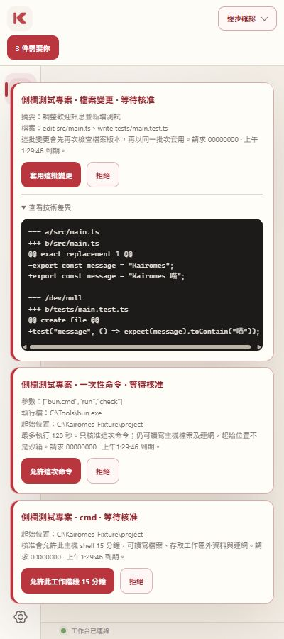
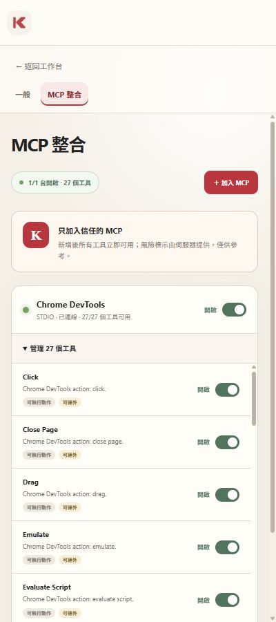
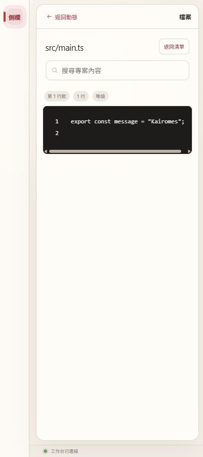

# Kairomes 側欄 UI／UX 檢視

日期：2026-10-02。範圍：0.1.4 現行元件的合成資料畫面與有限互動，400px 為主要寬度。來源、替換項目與未驗證項目見 [證據索引](evidence/index.md)。本稿不宣稱真實 ChatGPT／Tunnel／Extension 端到端流程已測。

目標：使用者能迅速看懂目前操作、決定是否核准、找到可檢查的成果；**UI 嚴禁大量或重複文字**。已使用 [Agent app 設計 skill](../../.agents/skills/agent-app-design/SKILL.md) 和 [Kairomes 規劃 skill](../../.agents/skills/kairomes-sidebar-planning/SKILL.md) 分配資訊責任。

## 主要判斷

現行暖色品牌、卡片、動態與按需展開方向可以保留。最高優先改善的是待核准浮層佔滿側欄、必要判斷文字過小、有效連線層級不清楚。窄版檔案詳情已有返回與焦點恢復；可沿用單閱讀區，不需要搬入完整桌面多面板布局。

| 問題 | 證據／分類 | 使用者影響 | 改善與優先級 |
| --- | --- | --- | --- |
| 多件核准遮住動態 | K2、K3：可見畫面 | 不能同時看見正在處理的操作；長 diff 讓其他卡下移 | 原生待處理佇列＋單件詳情，避免多張浮層全展開；P0 |
| 核准判斷資料過小 | K2、K3＋CSS：畫面／程式碼 | argv、主機範圍、期限不容易閱讀 | 核心欄位至少 14px，刪除重複文字，完整 argv 可展開；P0 |
| 配對／核准通道狀態窄版不可見 | K1～K6＋CSS：畫面／程式碼 | 品牌仍在，配對狀態消失；底列「工作台已連線」不是核准通道證據 | 顯示短狀態，異常時取代正常文字；P0 |
| 專案縮寫成本高 | K7～K9：畫面；多專案為待驗證假設 | 讀者需靠 hover／accessible name 才知道全名 | 頂列專案選擇器；400px 回收 58px rail；P0 |
| 工具長清單巢狀捲動 | K6：可見畫面 | 搜尋某工具要逐項捲動，頁面與清單都有 scroll | 工具搜尋＋已開啟／全部篩選；單一主要捲動區；P1 |
| 同一操作可能跨層重複 | code 盤點；K2／K7 分別可見，未捕到所有同時狀態 | 視覺密度與狀態誤判 | 每個事實指定主顯示處；待處理摘要只顯示件數與一行；P0 |
| 歷史成果可能過期 | code：五分鐘保留，不是本次實測 | 按「查看」後才知道不能讀 | 明示「詳情已到期」，提供唯讀重新取得適用的資料；P1 |
| 活動沒有可信聊天歸屬 | protocol：沒有 task／conversation ID | 可能把其他聊天的操作當成當前工作 | 使用「本機操作」，不宣稱目前聊天；可信工作分組另研究；P0／P2 |

## 畫面步驟與可觀察互動

### 1. 配對入口 — 操作清楚，狀態與文字可再精簡

主動作清楚，配對輸入採密碼型態；目前說明散在前言與表單下。建議濃縮成「在 Desktop 取得配對連結」，以一個說明入口放完整流程。K1 是現行 markup 的靜態 fixture，沒有操作真實連結、複製或 host permission。不可由此認定配對已成功。

### 2. 三件待核准 — 密度與遮擋需優先改善

三件請求都具批準／拒絕，檔案與命令的授權語意有區分。浮層遮住動態，核心文字很小；開啟佇列應只呈現簡短列，選一件才看詳情。fixture 沒有真實核准憑證，這一步只檢查布局。

### 3. 展開差異 — 有完整入口，閱讀與動作順序可改善

實際點擊「查看技術差異」後，合成 diff 展開；程式碼可橫向捲動。核准按鈕在 diff 之前，展開後其他卡下移。建議單件詳情的 diff 與檔案清單置於決策動作之前；截斷時必須明示並能檢視全部必要內容。不能因未展開 diff 就宣稱使用者已審閱。

### 4. 權限選單 — 三模式可辨識，需直接說明作用範圍

實際展開真實 AccessPanel，看到專案、逐步確認、檔案自主與全自主。建議模式列只保留一句差異；在選全自主的決策位置明示「主機權限・同實例其他聊天可用」，期限與立即收回需可見。此次沒有變更任何真實授權。

### 5. 整合設定 — 結構清楚，介紹可收斂

伺服器狀態、工具件數和開關清楚。信任提示卡可改為新增整合時的必要提醒，日常主畫面只留狀態與管理入口；但改動不得藏掉「新增即啟用」的真實後果。新啟用策略若調整，需要另改 daemon 與文件，不能只改文案。

### 6. 展開工具 — 清單功能存在，長清單找尋成本高

實際展開管理清單，逐工具的名稱、描述、風險標示與 switch 可見。27 項時出現內外捲動區。建議先有搜尋／篩選，列表只顯示名稱、狀態，詳細工具描述在點入時呈現；風險標示仍註明是伺服器提供的資訊，不能當作安全認證。

### 7. 動態 — 主軸可讀，但操作完成不能代表任務完成

兩筆合成工具完成事件容易辨識；目前專案名、狀態與操作標題在卡片內。建議將專案移到固定選擇器，卡片僅保留一次操作／狀態／查看。事件未綁定聊天；不要改成「你的任務已完成」。

### 8. 檔案詳情與返回 — 有良好基礎

從「查看」進入檔案後，動態被單一詳情取代；返回按鈕取得焦點。實際返回後，焦點回到原先的「查看」按鈕，值得保留。全文搜尋、只讀標示與程式碼區可見；長程式碼仍需橫向捲動。沒有測試讀屏、200% zoom 或完整鍵盤循環。

### 9. 720px 對照 — 空間增加後仍維持單閱讀區

較寬時仍維持動態主區；不構成把多面板移入 400px 側欄的理由。360／480px、實際瀏覽器側欄 resizing、長名稱與多專案尚需後續驗收。

## 無障礙與未驗證事項

已有 accessible name、status／alert、部分焦點恢復及 reduced motion 程式碼；本次觀察到詳情返回焦點正確。核准詳情的小字是可見閱讀風險，非完整 WCAG 測試結果。

後續需檢查 200% zoom／reflow、鍵盤順序、popover 焦點與 Escape、卡片消失的焦點回收、色彩對比、screen reader 狀態宣告、24px 最小目標／32px 建議目標、十件核准與結果到期。配對失效、SSE 斷線、真正核准、程序取消與 ChatGPT 宿主依能力發訊另做受控流程測試。具體規格見 [後續開發計畫](development-plan.md)。
